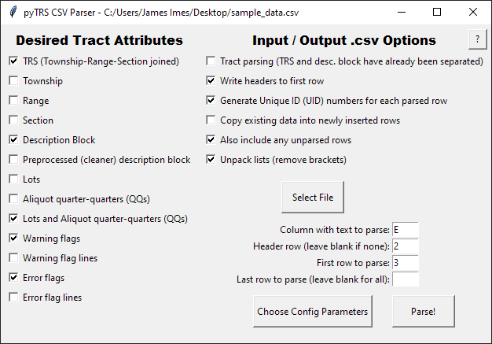

# pyTRS CSV Suite

An included implementation of pyTRS for parsing PLSS descriptions and/or tracts in .csv files.
Copyright (c) 2020, James P. Imes, all rights reserved.
Contact <jamesimes@gmail.com>


## Overview

the CSV Suite is driven by a single function, which runs through rows of data in a .csv file, parsing all PLSS descriptions in a specific column, and outputting the parsed data, alongside the original data, in a new .csv file; inserting rows/columns as necessary.

The [function itself](https://github.com/JamesPImes/pyTRS/blob/master/Documentation/csv_suite%20documentation/csv_readme.md#the-function-pytrscsv_suiteparse_csv) can obviously be imported into your script:

```
>>> from pyTRS.csv_suite import parse_csv
>>> parse_csv(blah blah blah...)
```

Or there is a [command-line](https://github.com/JamesPImes/pyTRS/blob/master/Documentation/csv_suite%20documentation/csv_readme.md#command-line-implementation---pytrs_parse_csv_cmdpy) implementation.

Most simply, there is a [GUI application](https://github.com/JamesPImes/pyTRS/blob/master/Documentation/csv_suite%20documentation/csv_readme.md#gui-implementation---pytrs_parse_csv_guipyw) with the same functionality. To use the GUI app, either run `pyTRS\csv_suite\pyTRS_parse_csv_gui.pyw` directly, or `import pyTRS` in  a Python console and call `pyTRS.csv_suite.launch_gui()`.




### The function `pyTRS.csv_suite.parse_csv()`

To use the function directly:

```
from pyTRS.csv_suite import parse_csv

# In this sample input file, the fifth column contains descriptions to be parsed; 
# the second row contains headers; 
# and the first description to be parsed appears in the third row.

# If `out_file=` were not specified in kwarg, it will be created.
output_file = 

parse_csv(in_file = r'C:\Land Data\Project R\sample_data.csv',
	out_file = r'C:\Land Data\Project R\sample_data_output.csv', 
    desc_col=5, first_row=3, header_row=2, 
    attribs='trs,desc,lotQQList,wFlagList,eFlagList',
    write_headers=True, unpack=True, copy_data=True, include_uid=True,
    include_unparsed=True, config='n,w,segment'
    )
```

If we only want to parse *some* of the rows, we can stop early by specifying `last_row=<int>`.


##### Required arguments:
* `in_file=<str>` -- Filepath to input .csv file
* `desc_col=<int>` __\*\*__ -- The column containing descriptions to be parsed.
* `attribs=<str or list>` -- The parsed tract data to be written (i.e. Tract object attributes). Can be either a single string (attributes separated by commas, with no spaces) or as a list of attribute names. (Technically, if not specified, will use a few default attributes.)


##### Optional arguments:
* `out_file=<str>` -- Filepath to output .csv file
* `first_row=<int>` __\*\*__ -- The first row containign descriptions to be parsed. (If not specified, will start with first row.)
* `last_row=<int>` __\*\*__ -- The last row to be parsed. (If not specified, will parse all rows in the file.)
* `header_row=<int>` __\*\*__ -- The row in the input file that contains headers.
* `layout_col=<int>` __\*\*__ -- The column containing the pyTRS layout to be used for the description in that row. (Requires preprocessing your data.)
* `config_col=<int>` __\*\*__ -- The column containing the pyTRS layout to be used for the description in that row. (Requires preprocessing your data.)
* `write_headers=<bool>` -- Write headers to the output file.
* `include_uid=<bool>` -- Create a Parse Unique Identifier Number ("UID") for each row that gets parsed, in the format `0000.a-k`.
* `unpack=<bool>` -- Convert lists of data into flattened strings (e.g., `['L1', 'L2', 'NENW', NWNW']` should be unpacked and written as `L1, L2, NENW, NWNW`).
* `copy_data=<bool>` -- If rows are inserted, copy the original data for each row.
* `tract_level=<bool>` -- Working with a dataset whose Twp/Rge/Sec have already been separated out, and now we just need to parse tracts (i.e. lots/QQ's).
* `include_unparsed=<bool>` -- If any rows are not parsed (e.g., before headers, or after user-specified `last_row`), such rows should also get copied to the output file.
* `num_tracts=<bool>` -- Also generate a *second* output .csv file, whose values correspond to the number of rows written for each original description. For example, if the first description was parsed into five Tract objects and therefore written into five rows in the output .csv, then the value for the first row would be 5. If the second description only contained one tract, the next row would be 1. Etc. (Potentially useful for comparing numbers of rows in the input vs. output .csv, if you need to match up results.)


__\*\*__ *__Note: All columns and rows are indexed from 1.__*


### Command-line implementation - `pyTRS_parse_csv_cmd.py`

To use it as a command-line program: run `pyTRS\csv_suite\pyTRS_parse_csv_cmd.py` with appropriate command-line arguments.

Sample use:
```
C:\...pyTRS\csv_suite\py pyTRS_parse_csv_cmd.py -i "C:\Land Data\Project R\sample_data.csv" -o "C:\Land Data\Project R\sample_data_output.csv" -dc 5 -hr 2 -fr 3 -a trs,desc,lotQQList,wFlagList,eFlagList
```

Only brief explanations are given for these arguments, since nearly all of them mirror `parse_csv()` kwargs.

##### Required arguments:
* `-i`, `--input_csv`, -- `<str>` path to input .csv file
* `-dc`, `--desc_column` -- `<int>` The number of the column (indexed from 1) containing PLSS descriptions
* `-a`, `--attribs` -- `<str>` Tract attributes that should be included in output (separate by comma: `-a trs,desc`)

##### Optional arguments:
* `-o`, `--output_csv` -- `<str>` path to new output .csv file
* `-fr`, `--first_row` -- `<int>` Which row to start at (indexed from 1)
* `-lr`, `--last_row` -- `<int>` Which row to stop after (indexed from 1)
* `-hr`, `--header_row` -- `<int>` Which row contains headers (indexed from 1)
* `-lc`, `--layout_column` -- `<int>` The number of the column (indexed from 1) containing the layout for each description (requires the user to prep input .csv to specify the layout for each row)"
* `-cc`, `--config_column` -- `<int>` The number of the column (indexed from 1) containing the config parameters for each description (requires the user to prep input .csv to specify config parameters for each row)

__The following optional arguments are bools. If specified, they will switch on:__
* `-cf`, `--config` -- config parameters to use for all rows (alternative to `--config_column`, if not using a user-prepped dataset)
* `-cd`, `--copy_data` -- Copy existing data to any newly inserted rows
* `-to`, `--tracts_only` -- Tracts have already been separated from TRS in input .csv; now only parsing lots and QQ's (equivalent to `tract_level=<bool>` in `parse_csv()`)
* `-sh`, `--suppress_headers` -- Do NOT write headers in the output .csv file *__(NOTE: opposite functionality of `write_headers=<bool>` in `parse_csv()`)__*
* `-r`, `--resume` -- Resume writing to an existing output .csv file (if one exists at the specified output filepath)
* `-u`, `--unpack` -- unpack any Tract data stored as a list when writing to output .csv file
* `-uid`, `--include_uid` -- Generate unique identifier number (UID) for each description parsed
* `-iu`, `--include_unparsed` -- Also write the unparsed rows (i.e. copy them) to the output .csv file
* `-nt`, `--number_tracts` -- Generate a separate .csv file that states how many rows were written for each description
* `-launch`, `--launch` -- A quality of life option to launch the output .csv file after writing.