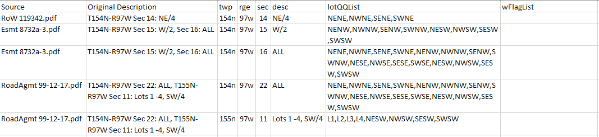

**Note:** This documentation assumes you are familiar with the terms *township*, *range*, *section*, *aliquots*, and *lots* in the context of the Public Land Survey System. See the provided [primer on PLSS land descriptions](plssPrimer.md)---or better yet, [Wikipedia's article](https://en.wikipedia.org/wiki/Public_Land_Survey_System).

Land professionals will probably know PLSS descriptions as *legal descriptions*. The term *PLSS descriptions* is favored in the documentation and code, but you could import `PLSSDesc` as `LegalDesc`, if you prefer seeing that terminology, thus: `from pyTRS import PLSSDesc as LegalDesc`

Also, read the readme for the full disclaimer, but it is important to realize that the outputs of this library should NOT be used in legal documents---only for data analysis!

Finally, note that all of the example PLSS descriptions used in this documentation, in the comments in the code, and in the provided test data are all dummy data and were invented or arbitrarily chosen. (Some are even nonsense.)

## Quick Start Guide

First, read the [Overview](https://github.com/mesji/pyTRS/blob/master/documentation/documentation.md#overview).

__Parsing the text of PLSS Land Descriptions (`PLSSDesc` objects):__

For parsing full PLSS descriptions, look into [`PLSSDesc` objects](https://github.com/mesji/pyTRS/blob/master/documentation/documentation.md#creating-plssdesc-objects-and-parsing-text) and especially the [`PLSSDesc.parse()` method](https://github.com/mesji/pyTRS/blob/master/documentation/documentation.md#plssdescparse-optional-kwargs), which can also be called behind-the-scenes when initializing a `PLSSDesc` object with kwarg [`initParse=True` or `initParseQQ=True`](https://github.com/mesji/pyTRS/blob/master/documentation/documentation.md#optional-kwargs-for-initializing-plssdesc-objects), and [customized with init kwarg `config=`](https://github.com/mesji/pyTRS/blob/master/documentation/documentation.md#config-objects-and-config-kwarg-and-setconfig-method).

For understanding how the data of a parsed PLSS description is stored and accessed, see [`PLSSDesc` instance variables](https://github.com/mesji/pyTRS/blob/master/documentation/documentation.md#plssdesc-instance-variables).

__Parsing Lots and Aliquots, and working with `Tract` objects:__

For parsing lots and aliquots within a given tract, look at the [working guide to `Tract` objects and the `Tract.parse()` method](https://github.com/mesji/pyTRS/blob/master/documentation/documentation.md#a-working-guide-to-tract-objects-and-the-tractparse-method).

For understanding how the data of a parsed Tract is stored and accessed, see [`Tract` object instance variables](https://github.com/mesji/pyTRS/blob/master/documentation/documentation.md#tract-object-instance-variables).

__Configure how the text should be parsed:__
To configure how the text in a `PLSSDesc` object and/or `Tract` object should be handled by the parser, see info on the [`config=` parameters and `Config` objects](https://github.com/mesji/pyTRS/blob/master/documentation/documentation.md#config-objects-and-config-kwarg-and-setconfig-method).


__Extract Data from parsed PLSS descriptions and tracts:__

For extracting data from parsed land descriptions (`PLSSDesc` objects) into a __list of lists__, or __list of dict__, look into the [`PLSSDesc.extractTractData()` method](https://github.com/mesji/pyTRS/blob/master/documentation/documentation.md#plssdescextracttractdata).

For extracting data from individual `Tract` objects into a __list__ or __dict__, look into the [`Tract.extractData()` method](https://github.com/mesji/pyTRS/blob/master/documentation/documentation.md#the-extractdata-method-on-tract-objects)

For extracting data from parsed PLSS descriptions (`PLSSDesc` objects) and/or tracts (`Tract` objects) __into a .csv file__, look into the [`outputToCSV()` function](https://github.com/mesji/pyTRS/blob/master/documentation/documentation.md#outputtocsv).


## Overview

The two main classes in the pyTRS library are `PLSSDesc` objects and `Tract` objects.
`PLSSDesc` objects will create `Tract` objects when parsed, although the client can also create `Tract` objects directly.

Each `PLSSDesc` object is initiated with raw text (the original PLSS description, stored in the `.origDesc` attribute), which gets parsed into one or more `Tract` objects, which in turn are stored in a list in the `.TractList` attribute.

Each `Tract` object consists of exactly one township + range + section combination (or "TRS", stored as a string in the `.trs` attribute) and description block (stored as a string in the `.desc` attribute), and various other data.

As mentioned, parsing a `PLSSDesc` object will automatically create one or more `Tract` objects, but if we are working with PLSS descriptions that have already been broken into their component parts (i.e. with each description block separate from its township, range, and section), and we only need to parse into lots and aliquots, we can create `Tract` objects directly.

*__In short:__*
* `PLSSDesc` object -- Township, Range, Section, and description block are all part of the same string; and multiple TRS's are possible.
* `Tract` object -- The Township/Range/Section combination has already been separated from the description block; and only one TRS is possible.

__For example__, parsing the following text...
```
text = '''Township 154 North, Range 97 West
Section 14: NE/4
Section 15: Lots 1 - 4, SW/4'''
```

... will result in a `.TractList` that contains two `Tract` objects, each with instance attributes as follows (among other data, as discussed in more detail elsewhere):

* *__First Tract__* -- (indexed as Tract `0`):
	* `.trs : '154n97w14'`
	* `.desc : 'NE/4'`
	* `.QQList : ['NENE', 'NWNE', 'SENE', 'SWNE']`
	* `.lotList : []`
	* `.origIndex : 0`

* *__Second Tract__* -- (indexed as Tract `1`):
	* `.trs : '154n97w15'`
	* `.desc : 'Lots 1 - 4, SW/4'`
	* `.QQList : ['NESW', 'NWSW', 'SESW', 'SWSW']`
	* `.lotList : ['L1', 'L2', 'L3', 'L4']`
	* `.origIndex : 1`

As a quick demonstration, all of the above data was parsed and accessed in two commands in the shell after importing pyTRS:
```
>>> desc1 = pyTRS.PLSSDesc('''Township 154 North, Range 97 West
Section 14: NE/4
Section 15: Lots 1 - 4, SW/4''', initParseQQ=True)

>>> desc1.extractTractData(['trs', 'desc', 'QQList', 'lotList', 'origIndex'], output='dict')
	[{'trs': '154n97w14', 'desc': 'NE/4', 'QQList': ['NENE', 'NWNE', 'SENE', 'SWNE'], 'lotList': [], 'origIndex': 0},
	{'trs': '154n97w15', 'desc': 'Lots 1 - 4, SW/4', 'QQList': ['NESW', 'NWSW', 'SESW', 'SWSW'], 'lotList': ['L1', 'L2', 'L3', 'L4'], 'origIndex': 1}]
```
Or in a short script, this might be more cleanly depicted as follows:
```
from pyTRS import PLSSDesc

# The text we need parsed:
text = '''Township 154 North, Range 97 West
Section 14: NE/4
Section 15: Lots 1 - 4, SW/4'''

# The attributes we want to pull from each `Tract` object:
attribs = ['trs', 'desc', 'QQList', 'lotList', 'origIndex']

# Parse the text and store only the needed `Tract` data in a list of dicts.
extractData = PLSSDesc(text, initParseQQ=True, config='n,w,cleanQQ').extractTractData(attribs, output='dict')
```
In the final line of this script, we create the `PLSSDesc` object (without bothering to store it to a variable), parse its text, and extract the values of the desired `Tract` instance attributes (i.e. we pull the attributes named in our list that is arbitrarily called `attribs`) for all of the `Tract` objects created by the `PLSSDesc` object. We store those values to our list `extractData` (which is identical to the list at the end of shell commands above).


## Creating `PLSSDesc` objects and parsing text

*__Note:__ [Initialization kwargs](https://github.com/mesji/pyTRS/blob/master/Documentation/documentation.md#optional-kwargs-for-initializing-plssdesc-objects) for creating `PLSSDesc` objects, [instance variables](https://github.com/mesji/pyTRS/blob/master/documentation/documentation.md#plssdesc-instance-variables) containing the object's data, and [input `layout` options](https://github.com/mesji/pyTRS/blob/master/documentation/documentation.md#possible-plssdesclayout-options) are discussed below.*


First, a guide on how to parse text.

It is possible to create a `PLSSDesc` object and parse the text in one step--but first we'll do it the long way, in case you need to work with the object before parsing it.

Create a `PLSSDesc` object whose first argument is the text that will be parsed:
```
>>> import pyTRS
>>> desc1 = pyTRS.PLSSDesc('''Township 154 North, Range 97 West, 5th P.M.
Section 14: NE/4
Sections 15 - 17: ALL''')
```

After creating the `PLSSDesc` object, we can call the `PLSSDesc.parse()` method on the object, which will parse the text into its component parts, which in turn are used to create `Tract` objects.
```
>>> desc1.parse()
	[<pyTRS.Tract object at 0x039E4D78>, <pyTRS.Tract object at 0x039E4DD8>, <pyTRS.Tract object at 0x039E4CE8>, <pyTRS.Tract object at 0x039E4F70>]
```

If we don't care to modify the `PLSSDesc` object before parsing, we can prompt it to be parsed upon initialization, with `initParse=True` (off by default):
```
>>> desc1 = pyTRS.PLSSDesc('''Township 154 North, Range 97 West, 5th P.M.
Section 14: NE/4
Sections 15 - 17: ALL''', initParse=True)
 
>>> desc1.prDesc()  # A simple method for printing the parsed PLSS description
	154n97w14: NE/4
	154n97w15: ALL
	154n97w16: ALL
	154n97w17: ALL
```

Similarly, if we want lots and quarter-quarters (QQ's) to be parsed for each Tract, we can automate that at initializing with `initParseQQ=True` (off by default):
```
>>> desc1 = pyTRS.PLSSDesc('''Township 154 North, Range 97 West, 5th P.M.
Section 14: NE/4
Sections 15 - 17: ALL''', initParseQQ=True)
```
(Note that `initParseQQ=True` entails `initParse=True`, but not the other way around.)

If you want to wait to parse the `PLSSDesc` object, but still want to specify `initParseQQ=True` later, it can be done when the `PLSSDesc.parse()` method is called:
```
>>> desc2 = pyTRS.PLSSDesc('''Township 154 North, Range 97 West, 5th P.M.
Section 14: NE/4
Sections 15 - 17: ALL''')
>>> desc2.parse(initParseQQ=True)
	[<pyTRS.Tract object at 0x03738DD8>, <pyTRS.Tract object at 0x039E4E50>, <pyTRS.Tract object at 0x039E4FA0>, <pyTRS.Tract object at 0x039E4D18>]
```

*__Note:__ The `PLSSDesc.parse()` method returns a list of `Tract` objects.  When optionally fed `commit=True` (which is `True` by default), the list of `Tract` objects will be committed to the `.TractList` instance attribute of the `PLSSDesc` object. When a `PLSSDesc` object is initialized with `initParse=True` or `initParseQQ=True`, the list is not returned, but rather committed directly to the `.TractList` variable.*

As a demonstration, we'll parse two `PLSSDesc` objects with the same text, one with `commit=True`, the second with `commit=False`:
```
>>> text = '''Township 154 North, Range 97 West, 5th P.M.
Section 14: NE/4
Sections 15 - 17: ALL'''

>>> desc2 = pyTRS.PLSSDesc(text)
>>> desc2.parse(initParseQQ=True, commit=True)  # `commit=True` is the default
	[<pyTRS.Tract object at 0x03738DD8>, <pyTRS.Tract object at 0x039E4E50>, <pyTRS.Tract object at 0x039E4FA0>, <pyTRS.Tract object at 0x039E4D18>]
>>> desc2.TractList
	[<pyTRS.Tract object at 0x03738DD8>, <pyTRS.Tract object at 0x039E4E50>, <pyTRS.Tract object at 0x039E4FA0>, <pyTRS.Tract object at 0x039E4D18>]

>>> desc3 = pyTRS.PLSSDesc(text)
>>> desc3.parse(initParseQQ=True, commit=False)
	[<pyTRS.Tract object at 0x039E4E68>, <pyTRS.Tract object at 0x039EC208>, <pyTRS.Tract object at 0x039EC1C0>, <pyTRS.Tract object at 0x039EC7F0>]
>>> desc3.TractList  # will return an empty list, because the previous parse was not committed
	[]
```
Thus, we can pull a list of `Tract` objects from a `PLSSDesc` object without committing them:
```
>>> workingTractList = desc3.parse(initParseQQ=True, commit=False)
>>> workingTractList[0].QQList  # The `QQList` attribute of the first `Tract` object in the list
	['NENE', 'NWNE', 'SENE', 'SWNE']
```

#### `PLSSDesc.parse()` optional kwargs:

* `layout=<str>`  --  Specify the layout of the input PLSS description.  *__(Important: See more on [`PLSSDesc` layouts](https://github.com/mesji/pyTRS/blob/master/Documentation/documentation.md#possible-plssdesclayout-options) below.)__*
* `commit=<bool>`  --  Commit the resulting `Tract` objects to the `.TractList` instance attribute. (Defaults to `True`.)
* `initParseQQ=<bool>`  --  Parse the aliquots and lots in each identified Tract. (Defaults to `False`.)
* [`cleanQQ=<bool>`](https://github.com/mesji/pyTRS/blob/master/Documentation/documentation.md#using-the-cleanqq-config-setting-and-kwarg) --  Tell the parsing algorithm whether or not you have very clean data, with nothing but simple aliquots and lots in each tract (i.e. no metes-and-bounds descriptions, exceptions, etc.). This will broaden the aliquot parsing capabilities, but will likely result in false matches if the data is not actually clean. (Defaults to `False`.) -- *__Note:__ `cleanQQ` can also be set via `config=` kwarg with `'cleanQQ'`. In the event of a conflict between the object's `config` settings and the optional bool value in the `.parse(cleanQQ=)` kwarg (i.e. `config='cleanQQ'` but `PLSSDescObj.parse(cleanQQ=False)` -- or vice versa), the kwarg will control. Thus, use the kwarg to override config settings, if needed.*
* `segment=True`  --  Break the description into segments (based on location of T&R), and parse each segment separately. (__Might__ capture descriptions whose layout changes throughout.  *__[Read more about limitations here.](https://github.com/mesji/pyTRS/blob/master/Documentation/documentation.md#segmented-parsing-with-configsegment-or-plssdescobjectparsesegmenttrue))__*

#### `PLSSDesc.preprocess()`
This method can be used to preprocess the text of the PLSS description, to iron out common kinks (misspellings, abbreviations, missing components).  It will return the preprocessed text string.  If `commit=True` is specified (on by default), it will also commit the result to the object's `.ppDesc` attribute.

##### `.preprocess()` optional kwargs:
* `layout=<str>`  --  Specify the layout of the input PLSS description.  *__(Important: See more on [`PLSSDesc` layouts](https://github.com/mesji/pyTRS/blob/master/Documentation/documentation.md#possible-plssdesclayout-options) below.)__*
* `commit=<bool>`  --  Commit the resulting preprocessed text to the `.ppDesc` instance attribute of the `PLSSDesc` object.  (Defaults to `True`.)
* `defaultNS='n'` or `defaultNS='s'`  --  Set this in case a township is found without North or South specified, so that it can automatically fill it in. *__Specify either 'n' or 's'. (Defaults to 'n'.)__*
* `defaultEW='w'` or `defaultEW='e' --  Set this in case a range is found without East or West specified, so that it can automatically fill it in. *__Specify either 'e' or 'w'. (Defaults to 'w'.)__*

*__Note:__ If a `PLSSDesc` object is initialized with `initParse=True` or `initParseQQ=True` (prompting it to parse immediately upon initialization), then `.preprocess()` will be automatically called, unless the object was __also__ initialized with `config=initPreprocess.False’`.*

#### `PLSSDesc.deduceLayout()`
This method will attempt to deduce the `layout` of the input text of the `PLSSDesc` object.  If text is not otherwise specified, this will pull from the object's `.ppDesc` attribute (i.e. the pre-processed text).  *__(Important: See more on [`PLSSDesc` layouts](https://github.com/mesji/pyTRS/blob/master/Documentation/documentation.md#possible-plssdesclayout-options) below.)__*

##### `.deduceLayout()` optional kwargs:
* `commit=<bool>`  --  Commit the resulting guessed layout to the `.layout` instance attribute of the `PLSSDesc` object.  (Defaults to `True`.)
* `candidateLayouts=<list>` -- Specify which `layout` options are available to the deduction algorithm. *__Note:__ May only use layouts understood by the program (i.e. `'TRS_desc'`, etc.).
* `deduceBy=<str>`  --  Specify how the algorithm should deduce the `layout`. Defaults to `'TRS_order'` (i.e. whether the word 'Section' appears before a Township & Range in the text, or vice versa). --- *__Note:__ Only `'TRS_order'` is currently implemented. Future versions will continue development of `'demerits'`.*
* `preprocess=<bool>`  --  Determine whether the text should be pre-processed for parsing, to iron out common typos, abbreviations, and errors in the text that may hinder the parsing algorithm. Specifically calls the `PLSSDesc.preprocess()` method and does NOT commit the preprocessed text to `.ppDesc` but DOES use the preprocessed text for deducing the `.layout`. (Defaults to `False` for this particular method.)


### `PLSSDesc` instance variables:
* `.origDesc`  --  a string containing the original text input
* `.ppDesc`  --  a string containing the pre-processed text (after running through the `.preprocess()` method)
* `.source`  --  a string containing the client-specified source of this PLSS description --- *e.g., `'Doc. #123456'` if it was pulled from recorded Document #123456 of some county's records; or `'Smith, John - Right of Way 20200611.pdf'` if it was pulled from said PDF*
* `.TractList`  --  a list of the `Tract` objects created during parsing
* `.wFlagList`  --  a list of [WARNING flags](https://github.com/mesji/pyTRS/blob/master/Documentation/flags.md) (list of strings)
* `.wFlagLines`  --  list of tuples that caused warning flags (each tuple containing the warning flag string, and the relevant text string)
* `.eFlagList`  --  a list of [ERROR flags](https://github.com/mesji/pyTRS/blob/master/Documentation/flags.md) (list of strings)
* `.eFlagLines`  --  list of tuples that caused error flags (each tuple containing the error flag string, and the relevant text string)
* `.descIsFlawed`  --  a bool, whether or not the `PLSSDesc` object was determined by the parsing algorithm to be fatally flawed (e.g., a missing township & range). -- *__Note:__ This variable being `False` does __not__ mean that the output is correct--just that the algorithm did not find any fatal flaws.*

The following instance variables may be set via `config=` kwarg at initialization, or the `.setConfig()` method. These are primarily useful *before* the parsing is completed:
* `.layout` -- a string specifying the layout of the input PLSS description.  *__(Important: See more on [`PLSSDesc` layouts](https://github.com/mesji/pyTRS/blob/master/Documentation/documentation.md#possible-plssdesclayout-options) below.)__*
* `.defaultNS` -- a one-character string (`'n'` or `'s'`) to tell the parsing algorithm whether it should assume "North" or "South" for a given township for which direction was not specified (i.e. for "Township 154, Range 97", whether it should assume "Township 154 *__North__*" or "Township 154 *__South__*") --- *__Note:__ Will NOT overrule townships for which N/S is specified in the input text.*
* `.defaultEW` -- a one-character string (`'e'` or `'w'`) to tell the parsing algorithm whether it should assume "East" or "West" for a given range for which direction was not specified (i.e. for "Township 154, Range 97", whether it should assume "Range 97 *__East__*" or "Range 97 *__West__*") --- *__Note:__ Will NOT overrule ranges for which E/W is specified in the input text.*
* `.initParseQQ`  --  a bool, whether or not to instruct subordinate `Tract` objects to parse lots/aliquots when they are created.
* [`.cleanQQ`](https://github.com/mesji/pyTRS/blob/master/Documentation/documentation.md#using-the-cleanqq-config-setting-and-kwarg)  --  a bool, whether or not we have *__only__* very clean input data, with nothing but simple aliquots and lots in each tract (i.e. no metes-and-bounds descriptions, exceptions, etc.). This will broaden the aliquot parsing capabilities, but will likely result in false matches if the data is not actually clean. (Defaults to `False`.)

### Optional kwargs for initializing `PLSSDesc` objects:

* `source=<str>`  --  Specify where the PLSS description came from (perhaps a specific row in a spreadsheet, or a particular PDF file)
* `layout=<str>`  --  Specify the layout of the input PLSS description. If layout is not specified, pyTRS will attempt to deduce the layout with the `.deduceLayout()` method. *__(Important: See more on [`PLSSDesc` layouts](https://github.com/mesji/pyTRS/blob/master/Documentation/documentation.md#possible-plssdesclayout-options) below.)__*
* `config=<string or Config object>`  --  Configure how the `PLSSDesc` object (and subordinate `Tract` objects) should be parsed. Takes either a single string containing all parameters, or an already-created `Config` object. *(For more information on how to customize the parse, see the parameters in documentation, or call `Config.parameters()` for a list of possible parameters, or call `Config.help()` for a more thorough summary of config functionality.)*
* `initParse=<bool>`  --  Parse the PLSS description upon initialization. (Defaults to `False`.)
* `initParseQQ=<bool>`  --  Parse the aliquots and lots in each identified Tract. (Defaults to `False`.)


```
from pyTRS import PLSSDesc  
  
# The text we need parsed (note that 'North' is not specified in the township):
text = 'NE of Sec 14, T154-R97W'  
  
# Where the text came from:  
src = 'RoW Agreement j8810.pdf'  

# Create the PLSSDesc object and parse it at initialization, assuming cleanQQ:
desc1 = PLSSDesc(text, source=src, layout='desc_STR', initParseQQ=True, config='cleanQQ')
  
desc1.prData('trs', 'QQList', 'source')
```
When run will print the following:
```
Tract #1
trs    : 154n97w14
QQList : NENE, NWNE, SENE, SWNE
source : RoW Agreement j8810.pdf
```

### Possible `PLSSDesc.layout` options:
pyTRS is capable of handling input data in various layouts (stored as a string in the `.layout` instance variable for each `PLSSDesc` object):

**-- Township - Range - Section - Description** (i.e. `'TRS_desc'`)
*T154N-R97W
Section 14: NE/4*
<sup>*__Note:__ This layout need not be on multiple lines, but it often is.*<sup>

**-- Description - Section - Township - Range** (i.e. `'desc_STR'`)
*NE/4 of Section 14, T154N-R97W*

**-- Section - Description - Township - Range** (i.e. `'S_desc_TR'`)
*Section 14: NE/4, in T154N-R97W*

**-- [unknown, or cannot deduce the layout]** (will default to `'copy_all'`)
*When the program can’t successfully deduce what the `layout` should be (likely due to flawed or highly non-standard input data), it will default to `'copy_all'`, which will prompt the parsing algorithm to look for a T&R and a Section, but ultimately just copy the entire text string as the parsed description.  This is a stopgap layout to prevent errors while still returning the data how it's expected by other functions and methods (i.e. in a list of `Tract` objects).*

__IMPORTANT:__ The `.layout` is crucial, because it tells the program how the text should be parsed.

When a `PLSSDesc` object is created, it will attempt to deduce the `layout`, unless the user has specified the `.layout` variable with `layout=` init kwarg (or prevented it with another init kwarg, `deduceLayout=False`).
```
>>> desc9 = pyTRS.PLSSDesc('T154N-R97W, Section 14: NE/4')  # will deduce
>>> desc9.layout
	'TRS_desc'
	
>>> desc10 = pyTRS.PLSSDesc('NE/4 of Section 14, T154N-R97W')  # will deduce
>>> desc10.layout
	'desc_STR'

>>> desc11 = pyTRS.PLSSDesc('NE/4 of Section 14, T154N-R97W', layout='TRS_desc')
>>> desc11.layout    # this layout is the user-specified value; it was not deduced
	'TRS_desc'
```

In the above `desc11` example, the user has incorrectly specified `layout`, which will result in errors:
```
>>> desc11.parse()
>>> desc11.prDesc()
	trError_secError: NE/4 of Section 14, T154N-R97W
```
Getting this parse error may be preferable if you know that your entire dataset is in the `'TRS_desc'` layout. Take this example, where the first Township and Range were inadvertently deleted by a data entry employee:
```
>>> text = '''Section 18: W/2
Township 154 North, Range 97 West, 5th P.M.
Section 14: NE/4'''
>>> desc12 = PLSSDesc(text, layout='TRS_desc', initParseQQ=True)
>>> desc12.prDesc()
	TRerr_18: W/2
	154n97w14: NE/4
```
Using this same text, but allowing the parsing algorithm to deduce the `layout` on its own results in a different description:
```
>>> desc13 = PLSSDesc(text, initParseQQ=True)
>>> desc13.prDesc()
	154n97w18: W/2
	TRerr_14: NE/4
```

Of course, either way generates an error because there's an error in the input data. But if you *know* the layout of your input data, specifying as such will mean at least one of the tracts will be correct.  (Once you spot the parsing error, your best bet is to just fix the input data.)

### Various `PLSSDesc` methods:

* `PLSSDesc.unpack()` --  Unpack (i.e. append or set) the relevant attributes of a `ParseBag` object into this `PLSSDesc` object's attributes. [See info on `ParseBag` objects](https://github.com/mesji/pyTRS/blob/master/Documentation/documentation.md#parsebag-objects)
* `PLSSDesc.parse()`  --  Parse the text of the PLSS description into its component parts (i.e. into `Tract` objects)
* `PLSSDesc.deduceLayout()`  --  Deduce the `layout` of the input PLSS description text.
* `PLSSDesc.preprocess()`  --  Preprocess the text of the PLSS description to iron out common kinks (i.e. abbreviations, typos, etc.)
* `PLSSDesc.genFlags()`  --  Generate common [warning and error flags](https://github.com/mesji/pyTRS/blob/master/Documentation/flags.md).
* `PLSSDesc.extractTractData()`  --  Extract a list of lists (or a list of dicts) for all of the requested data, from each `Tract` object in the `.TractList`
* `PLSSDesc.prDesc()`  --  Prints  the entire parsed TractList.
* `PLSSDesc.strDesc()`  --  Returns as a single string the entire parsed TractList.
* `PLSSDesc.prData()`  --  Prints all of the requested data for each `Tract` object in the `.TractList`
* `PLSSDesc.strData()`  --  Returns as a single string all of the requested data for each `Tract` object in the `.TractList`
* `PLSSDesc.listTRS()`  --  Returns a list all of the TRS's in the TractList. Optionally remove duplicates with `removeDuplicates=True` (off by default).

### Segmented Parsing with `config='segment'` or `PLSSDescObject.parse(segment=True)`
If the layout of a PLSS description changes partway through, it will be parsed incorrectly under __default__ settings, but __might__ be parsed correctly with *__segmented parsing__* -- either by using the config parameter `config='segment'` when initializing a `PLSSDesc` object, or by using the corresponding kwarg when calling the parsing method on a `PLSSDesc` object, i.e. `descObj.parse(segment=True)`.

For example, in the description stored as `text1` in the following script, the lands within T154N-R97W are in the `'TRS_desc'` layout, whereas the lands within T155N-R97W are in the `'TR_desc_S'` layout. `desc2` and `desc3` are both parsed with segmented parsing, and so the changing layout is caught by the parser.
```
>>> text1 = '''T154N-R97W
Sec 14: NE/4
Sec 15: W/2
T155N-R97W
ALL of Section 22'''

>>> desc1 = pyTRS.PLSSDesc(text1, initParse=True)  # This will NOT capture the tract in Section 22 of T155N-R97W
>>> desc1.prDesc()
	154n97w14: NE/4
	154n97w15: W/2

>>> desc2 = pyTRS.PLSSDesc(text1, initParse=True, config='segment')  # This will capture Sec 22
>>> desc2.prDesc()
	154n97w14: NE/4
	154n97w15: W/2
	155n97w22: ALL

>>> desc3 = pyTRS.PLSSDesc(text1)  # This will capture Sec 22
>>> desc3.parse(segment=True)
>>> desc3.prDesc()
	154n97w14: NE/4
	154n97w15: W/2
	155n97w22: ALL
```

Segmented parsing breaks the text of a PLSS description into segments, each containing only one *matching* T&R, based on the specified layout (or if not specified, then the deduced layout). Then, the layout of *each* segment is deduced independently of the other segments, and each segment is parsed according to that layout.

*__Note:__* If a user has specified the layout for a `PLSSDesc` object and has *also* opted to use segmented parsing, the specified layout will hold ONLY for breaking the description into segments. When the segments are actually parsed, the layout will be deduced.

#### Changing T&R order within a PLSS description causes errors

So as long as the order of the T&R within the description is consistent (i.e. it either comes first, or it comes last, but it does not change), segmentation should be successful, as with `text1` above and `text2` below. But changing the order of the T&R (e.g., `text3` below) will result in incorrect parsing.
```
>>> text2 = '''NE/4 of Sec 14, W/2 of Sec 15, T154N-R97W
Sec 22: ALL, T155N-R97W'''

>>> desc4 = pyTRS.PLSSDesc(text2, initParse=True, config='segment')  # will be successful
>>> desc4.prDesc()
	154n97w14: NE/4
	154n97w15: W/2
	155n97w22: ALL

>>> text3 = '''NE/4 of Sec 14, W/2 of Sec 15, T154N-R97W
T155N-R97W
ALL of Section 22'''
>>> desc5 = pyTRS.PLSSDesc(text3, initParse=True, config='segment')  # will NOT be successful
>>> desc5.prDesc()
    154n97w14: NE/4
    154n97w15: W/2
    155n97wsecError: T155N-R97W
```
This is currently a limitation of the library. Allowing the order of T&R to change throughout is a goal of subsequent development.

#### Changing layout *within a segment* causes errors

Note also that segmented parsing will NOT capture layouts that change *within* a given segment. For example, `text4` cannot be successfully parsed with segmented parsing (or with non-segmented parsing):
```
>>> text4 = '''T154N-R97W
Sec 14: NE/4
Sec 15: W/2
T155N-R97W
ALL of Section 22
Section 23: W/2'''

>>> desc6 = pyTRS.PLSSDesc(text4, initParse=True)  # NON-segmented parsing
>>> desc6.prDesc()
	154n97w14: NE/4
	154n97w15: W/2

>>> desc7 = pyTRS.PLSSDesc(text4, initParse=True, config='segment')  # Segmented parsing
>>> desc7.prDesc()
	154n97w14: NE/4
	154n97w15: W/2
	155n97w22: ALL
	155n97w23: ALL
```

It sees Sections 22 and 23, but it missed the `'W/2'` for Section 23. This is currently a limitation of the library. (Allowing multiple layouts within a given segment is a goal of subsequent development.)


## `Tract` objects

A [directory of instance variables](https://github.com/mesji/pyTRS/blob/master/Documentation/documentation.md#tract-object-instance-variables) and [methods](https://github.com/mesji/pyTRS/blob/master/Documentation/documentation.md#tract-object-methods-directory) is provided first. Below that is [a guide to working with `Tract` objects and further detail on the primary method, `Tract.parse()`](https://github.com/mesji/pyTRS/blob/master/Documentation/documentation.md#a-working-guide-to-tract-objects-and-the-tractparse-method).  And see the [`Tract.extractData()` method](https://github.com/mesji/pyTRS/blob/master/Documentation/documentation.md#the-extractdata-method-on-tract-objects) for extracting data from individual `Tract` objects.

### `Tract` object instance variables:
* `.trs`  --  The identifying Township-Range-Section, in the layout `'154n97w01'` (where `'n'` could alternatively be `'s'`, and `'w'` could be `'e'`, depending on North / South and West / East). Township and Range will be 1 to 3 digits long. Section will always be 2 digits long. (Unless an error occurred during parsing, in which case T&R might be stored as `'trError'` and/or section stored as `'secError'`.)
* `.twp` --  Just the Township component of `.trs`
* `.rge`  --  Just the Range component of `.trs`
* `.sec`  --  Just the Section component of `.trs`
* `.desc`  --  The description block of the tract (i.e. the 'NE/4' in 'T154N-R97W Sec 14: NE/4')
* `.source`  --  a client-specified string containing the origin of the PLSS description text (perhaps a specific row in a spreadsheet, or a particular PDF file) --- equivalent to a the `.source` attribute of a `PLSSDesc` object
* `.origIndex`  --  The order in which this `Tract` object was identified during parsing.
* `.QQList`  --  List of aliquots (QQ and smaller --- i.e. `['NENE', 'E2NWNE']` but `['NE']` would be broken down further )
* `.lotList`  --  List of standard lots (e.g., `['L1', 'L2', 'L5', 'L6', 'L7']`)
* `.lotQQList`  --  Combined list of `.lotList` and `.QQList`. -- *__Note:__ This attribute is created by joining the `.lotList` and `.QQList` lists specifically (i) at initialization or (ii) when the `Tract.parse()` method returns. Any manual modifications to `.lotList` or `.QQList` at other times will not result in corresponding modifications to `.lotQQList`.*
* `.lotAcres`  --  A dict, keyed by lots (i.e. `'L1'`, `'L2'`, etc.), whose values show the gross acres in the respective lot, if specified.

The following instance variables can be set with the `config=` kwarg at initialization (also inherited by a `Tract` object that is created by parsing a `PLSSDesc` object), or by calling the `.setConfig()` method. These are primarily useful *before* the parsing is completed:
* [`.cleanQQ`](https://github.com/mesji/pyTRS/blob/master/Documentation/documentation.md#using-the-cleanqq-config-setting-and-kwarg)  --  a bool, whether or not we have *__only__* very clean input data, with nothing but simple aliquots and lots in each tract (i.e. no metes-and-bounds descriptions, exceptions, etc.). This will broaden the aliquot parsing capabilities, but will likely result in false matches if the data is not actually clean. (Defaults to `False`.)
* `.defaultNS` -- a one-character string (`'n'` or `'s'`) to specify "North" or "South" for the township -- *__Note:__ Only relevant to a `Tract` object that was created by `Tract.fromTwpRgeSec()`, where  N/S was not specified.*
* `.defaultEW` -- a one-character string (`'e'` or `'w'`) to specify "East" or "West" for the range -- *__Note:__ Only relevant to a `Tract` object that was created by `Tract.fromTwpRgeSec()`, where E/W was not specified.*
* `.includeLotDivs`  --  a bool, whether or not divisions of lots should be reported (i.e., whether 'N/2 of Lot 1' should be reported as 'N2 of L1' or just 'L1').  --  *__Note:__ Defaults to `True` unless configured otherwise with `config='includeLotDivs.False'`.*

### `Tract` object methods directory:
* `Tract.fromTwpRgeSec(twp,rge,sec,desc)` -- Create a `Tract` object by inputting values for the Township (`twp`), Range (`rge`), Section (`sec`), and description block (`desc`). `twp`, `rge`,and `sec` can be input as strings --- or as integers (up to 3 digits for `twp` and `rge` and 2 digits for `sec`), in which case North/South is decided by kwarg `defaultNS='n'` (or `'s'`), and East/West is decided by kwarg `defaultEW='w'` (or `'e'`). --- *__Note__: All of the same init kwargs can be used here as well (`initParseQQ=True` etc.).*
* `Tract.parse()` -- Parse the lots and QQ's in the `.desc` of this `Tract` object; optionally store the results to the `.lotList`, `.QQList`, and `.lotQQList` variables  with `commit=True` (on by default)
* `Tract.extractData()`  --  Output the values of the selected attributes of this `Tract` object, either as a list (with the default `output='list'`), or as a dict (with `output='dict'`).
* `Tract.outputTRSdesc()`  --  Output the `.trs` + `.desc` of this `Tract` object, either as a joined string (the default `output='string'`), as a list (`output='list'`), or as a dict (`output='dict'`)
* `Tract.unpack()` --  Unpack (i.e. append or set) the relevant attributes of a `ParseBag` object into this `Tract` object's attributes. [See info on `ParseBag` objects](https://github.com/mesji/pyTRS/blob/master/Documentation/documentation.md#parsebag-objects)

### A working guide to `Tract` objects and the `Tract.parse()` method:
`Tract` objects are most easily created when automatically populating the `.TractList` of a `PLSSDesc` object (via the `PLSSDesc.parse()` method, or by parsing at initialization). However, the user can directly create `Tract` objects if the dataset already has its descriptions broken apart from township/range/section.
```
>>> tractObj = pyTRS.Tract(trs='154n97w14', desc='NE/4', initParseQQ=True, source='spreadsheet_3_row_022')
>>> tractObj.QQList
      ['NENE', 'NWNE', 'SENE', 'SWNE']
```

A `Tract` object  expects kwargs `trs=''` and `desc=''` at initialization. In fact, only `desc`  is required for core functionality. That said, we could create a `Tract` object without specifying these data at initialization, like so:
```
>>> tractObj2 = pyTRS.Tract()
>>> tractObj2.trs = '154n97w14'
>>> tractObj2.desc = 'Lots 1, 2, 4 - 6, NE/4'
>>> tractObj3.outputTRSdesc()
	'151n97w14: Lots 1, 2, 4 - 6, NE/4'
```
*(NB: Doing it this way will mean that `.twp`, `.rge`, and `.sec` variables will __not__ be set accordingly, unless we also do so manually.)*

Alternatively, we can also create a `Tract` object with the `Tract.fromTwpRgeSec()` method, feeding township, range, and section in as either strings, or as integers (in the latter case, kwarg `config=` will specify N/S and E/W for T&R):
```
>>> tractObj3 = Tract.fromTwpRgeSec('151n','97w','014', 'Lots 1, 2, 4 - 6, NE/4')
>>> tractObj3.outputTRSdesc()
	'151n97w14: Lots 1, 2, 4 - 6, NE/4'

>>> tractObj4 = Tract.fromTwpRgeSec(151,97,14, 'Lots 1, 2, 4 - 6, NE/4', config='n,w')
>>> tractObj4.outputTRSdesc()
	'151n97w14: Lots 1, 2, 4 - 6, NE/4'
```

Further, if we have not yet parsed QQ's and Lots, we can do it with the `Tract.parse()` method, regardless how the `Tract` object was created:
```
>>> tractObj2.parse(commit=True)  # commit=True is the default
	['L1', 'L2', 'L4', 'L5', 'L6', 'NENE', 'NWNE', 'SENE', 'SWNE']
```

The `Tract.parse()` method returns a joined list of the lots and QQ's. With optional kwarg `commit=True` (on by default), the respective results will be stored to the `.QQList`, `.lotList`, and `.lotQQList` instance variables of the `Tract` object.

So we can get that list without committing, if we need to:
```
>>> lq_list = tractObj2.parse(commit=False)
```

Lastly, note that feeding `includeLotDivs=False` (i.e. 'include lot divisions') as a kwarg to `Tract.parse()` (or configuring a `PLSSDesc` object or `Tract` object with `config='includeLotDivs.False'`) will cause `'N/2 of Lot 1'` to be returned as `'L1'` instead of the default `'N2 of L1'`:
```
>>> trObj5 = Tract('154n97w14', 'N/2 of Lots 1 - 3, NE/4, Lot 6')
>>> trObj5.parse(includeLotDivs=True)  # `True` is the default
	['N2 of L1', 'N2 of L2', 'N2 of L3', 'L6', 'NENE', 'NWNE', 'SENE', 'SWNE']
>>> trObj5.parse(includeLotDivs=False)
	['L1', 'L2', 'L3', 'L6', 'NENE', 'NWNE', 'SENE', 'SWNE']
```
*(`includeLotDivs=True` is the default, when not configured otherwise.)*


### Using the `cleanQQ` config setting and kwarg
Note that if you know you have a very clean dataset, with nothing but simple aliquots and lots (i.e. no metes-and-bounds descriptions, exceptions, etc.) then we can feed kwarg `cleanQQ=True` to the `Tract.parse()` method (or `config='cleanQQ'` when initializing a `PLSSDesc` object or a `Tract` object):
```
>>> desc3 = pyTRS.PLSSDesc('T154N-R97W Sec 14: NE', initParseQQ=True, config='cleanQQ')  # as a `config` string
>>> desc3.TractList[0].QQList
	['NENE', 'NWNE', 'SENE', 'SWNE']
>>> # or...
>>> desc4 = pyTRS.PLSSDesc('T154N-R97W Sec 14: NE')
>>> desc4.parse(initParseQQ=True, cleanQQ=True)  # as a kwarg
>>> desc4.TractList[0].QQList
	['NENE', 'NWNE', 'SENE', 'SWNE']
>>> # or...
>>> tractObj3 = pyTRS.Tract(trs='154n97w14', desc='NE', initParseQQ=True, config='cleanQQ')  # as a `config` string
>>> tractObj3.QQList
	['NENE', 'NWNE', 'SENE', 'SWNE']
>>> # or...
>>> tractObj4 = pyTRS.Tract(trs='154n97w14', desc='NE')
>>> tractObj4.parse(cleanQQ=True)  # as a kwarg
	['NENE', 'NWNE', 'SENE', 'SWNE']
```
`'NE'` as it appears in the text of `desc3`, `desc4`, `tractObj3`, or `tractObj4` will be matched as equivalent to "the Northeast Quarter" and correspondingly generate a `.QQList` containing `['NENE', 'NWNE', 'SENE', 'SWNE']`.

However, without `cleanQQ` being configured, the `QQList` will be empty *for this particular Tract*, because `'NE'` is not enough context to match "the Northeast Quarter" (without causing a lot of unwanted false matches generally):
```
>>> tractObj5 = pyTRS.Tract(trs='154n97w14', desc='NE')
>>> tractObj5.parse()  # `cleanQQ=False` is the default
	[]
>>> tractObj.QQList
	[]
```

On the other hand, `'NE/4'` or `NE4'` *would* properly match under either `cleanQQ=True` or the default `cleanQQ=False`, because `'.../4'` and `'...4'` offer enough context to deduce this abbreviation. And `'northeast quarter'` will always match, for obvious reasons.
```
>>> tractObj6 = pyTRS.Tract(trs='154n97w14', desc='NE\4')
>>> tractObj6.parse()
	['NENE', 'NWNE', 'SENE', 'SWNE']
>>> tractObj7 = pyTRS.Tract(trs='154n97w14', desc='Northeast Quarter')
>>> tractObj7.parse()
	['NENE', 'NWNE', 'SENE', 'SWNE']
```

(Aliquot recognition of short but common abbreviations under `cleanQQ=False` situations is an area for improvement in future versions.)

Lastly, note that even if a `PLSSDesc` object or a `Tract` has been configured with `config='cleanQQ'`, the kwarg in `.parse(cleanQQ=False)` (on either type of object) will overrule the config setting. But if `config='cleanQQ'` was set, we do not need to specify `cleanQQ=True` when parsing.

 


## Warning Flags and Error Flags in `PLSSDesc` and `Tract` objects
`PLSSDesc` objects and `Tract` objects each contain the following instance variables, each beginning as an empty list unless specified otherwise when the object is initialized:
* `.wFlagList`  --  a list of WARNING flags (list of strings)
* `.wFlagLines`  --  list of tuples that caused warning flags (each tuple containing the warning flag string, and the relevant text string)
* `.eFlagList`  --  a list of ERROR flags (list of strings)
* `.eFlagLines`  --  list of tuples that caused error flags (each tuple containing the error flag string, and the relevant text string)

These lists are filled throughout the parsing process.

The meaning of each warning flags and error flags is [provided in flags.md](https://github.com/mesji/pyTRS/blob/master/Documentation/flags.md), but below is a rundown of how they're accessed and the broad strokes of why they might be generated:

### Warning Flags
Warning flags are intended to be issues that the user may want to know about, but which don’t necessarily mean that the parsing failed. For example, `'sec_not_pulled<15>'` means that the program noticed 'Section 15' in the input text but decided it wasn’t intended to be the section of a separate tract, such as here:
```
>>> desc2 = pyTRS.PLSSDesc('T154N-R97W Sec 14: The NW/4, subject to an access easement for use in the NE/4NE/4 of Section 15, T155N-R97W', initParse=True)
>>> desc2.wFlagList
      ['TR_not_pulled<155n97w>', 'sec_not_pulled<15>']
```

In this case, the program also noticed that 'T155N-R97W' in the input text does not fit the pattern that it’s looking for and passed over it. Similarly, it noticed that 'Section 15' doesn’t fit the pattern. However, it can’t tell whether the input data is correctly laid out, or laid out in such a way that it can’t read correctly, and so creates warning flags `'TR_not_pulled<155n97w>'` and ` 'sec_not_pulled<15>'` to alert the user to double-check the original text to make sure it was handled properly.

*__Important:__ Warning flags do NOT mean that the results are wrong--just that you should specifically take a look at the input and output.*


### Error Flags
Conversely, error flags arise when the program is pretty sure that a failure has occurred during parsing. Perhaps no Township&Range was found, as in the following example:
```
>>> desc3 = pyTRS.PLSSDesc('NE/4 of Section 14, T154-', initParse=True)
>>> desc3.eFlagList
	['noTR']
```

The computer noticed that there’s no complete T&R, and so cannot parse this text correctly. It generated the error flag `'noTR'`.

If any error flag has been generated for a given `Tract` object or `PLSSDesc` object, the `.descIsFlawed` attribute will be set to `True` (for both the `PLSSDesc` object and all of its `Tract` objects).


### Accessing wFlagLines and eFlagLines
In addition to `wFlagList` and `eFlagList`, the user can access the lines that prompted those flags, in the `wFlagLines` and `eFlagLines` attributes.

`wFlagLines` and `eFlagLines` are each a list of tuples. Each tuple contains the flag (first element) and a string of the text that caused the flag (second element).

__Note:__ Each `Tract` object will have the entire `PLSSDesc` object's warnings and errors, because a computer can't automatically tell which limitations, etc. apply to which tracts. This is an ambiguity that often exists in the input data, even when humans read it. For example:
```
>>> desc4 = pyTRS.PLSSDesc('''Township 154 North, Range 97 West, 5th P.M.
Section 14: NE/4
Township 155 North, Range 97 West, 5th P.M.
Section 15: SW/4
Except those lands conveyed to John Smith in Deed dated May 1, 1974''', initParse=True)

>>> desc4.wFlagLines  # the entire PLSS description
      [('except', 'Except those lands conveyed to John Smith in Deed dated May 1, 1974')]
      
>>> desc4.TractList[0].wFlagLines  # the 154n97w14 Tract
      [('except', 'Except those lands conveyed to John Smith in Deed dated May 1, 1974')]

>>> desc4.TractList[1].wFlagLines  # the 154n97w15 Tract
      [('except', 'Except those lands conveyed to John Smith in Deed dated May 1, 1974')]
```

If you’re accessing specifically the `154n97w14` Tract (indexed `0` in the `.TractList`), you would want to know about this exception, as it may be relevant to that parcel. (You won’t know what lands were conveyed to John Smith until you go look at the referenced deed, so the description is ambiguous in the original.)


## Accessing and Outputting data in `PLSSDesc` objects and `Tract` objects
There are a few methods for extracting data from `PLSSDesc` and `Tract` objects after they’ve been parsed.
* `PLSSDesc.prDesc()` -- a method that prints each Tract's description in a given `PLSSDesc` object.

* `PLSSDesc.prData(attributes)` -- a method that prints the requested data for each `Tract` object in the `.TractList`, specifically printing the `Tract` attributes fed in as positional args (or fed in as a list of attributes)---i.e. `desc1.prData('trs', 'desc', 'wFlagList')`

* `PLSSDesc.strDesc()` - a method that returns a single string of all Tracts descriptions

* `PLSSDesc.extractTractData(attributes)` - a method that returns a list of the requested data for each `Tract` object in the `.TractList` of a `PLSSDesc` object. Specifically, for each `Tract`, it outputs the attributes fed in as arguments (or fed in as a single list of attributes)---i.e. `desc1.extractTractData('trs', 'desc', 'wFlagList')` or `desc1.extractTractData(['trs', 'desc', 'wFlagList'])`

* `outputToCSV()` - a function that takes all of the requested data for each `Tract` object in the `.TractList` of *one or more* `PLSSDesc` objects (or from one or more `Tract` objects), and writes it to a .csv file, with one row per `Tract` object

### `PLSSDesc.prDesc()` and `PLSSDesc.strDesc()`
You can print the parsed PLSS description with the `.prDesc()` method:
```
>>> desc1 = pyTRS.PLSSDesc('''Township 154 North, Range 97 West, 5th P.M.
Section 14: NE/4
Sections 15 - 17: ALL''', initParse=True)
>>> desc1.prDesc()
	154n97w14: NE/4
	154n97w15: ALL
	154n97w16: ALL
	154n97w17: ALL
```

The `.strDesc()` method will return a string of the parsed description, rather than printing it:
```
>>> parsedText = desc1.strDesc()
>>> parsedText
	'154n97w14: NE/4\n154n97w15: ALL\n154n97w16: ALL\n154n97w17: ALL'
```

Both `.strDesc()` and `.prDesc()` have an optional kwarg `delineator=<str>` for specifying respectively what should delineate the TRS from description block (default to `': '`). They both also have an optional kwarg `lineBreaker=<str>` for specifying what should come between Tracts (default to `'\n '`):
```
>>> parsedText = desc1.strDesc(delineator='_', lineBreaker='\n\n')
>>> print(parsedText)
	154n97w14_NE/4
	
	154n97w15_ALL
	
	154n97w16_ALL
	
	154n97w17_ALL

>>> desc1.prDesc(delineator='~', lineBreaker='\t')
      154n97w14~NE/4	154n97w15~ALL	154n97w16~ALL	154n97w17~ALL
```

### `PLSSDesc.prData()` and `PLSSDesc.strData()`
You can print the requested data for each `Tract` of a parsed PLSS description with the `.prData()` method:
```
>>> desc1 = pyTRS.PLSSDesc('''Township 154 North, Range 97 West, 5th P.M.
Section 14: NE/4
Sections 15 - 17: ALL''', initParse=True)

>>> desc1.prData('trs', 'desc', 'wFlagList')

	Tract #1
	trs       : 154n97w14
	desc      : NE/4
	wFlagList : multiSec_found<15, 16, 17>

	Tract #2
	trs       : 154n97w15
	desc      : ALL
	wFlagList : multiSec_found<15, 16, 17>

	Tract #3
	trs       : 154n97w16
	desc      : ALL
	wFlagList : multiSec_found<15, 16, 17>

	Tract #4
	trs       : 154n97w17
	desc      : ALL
	wFlagList : multiSec_found<15, 16, 17>
```
The `.strData()` method does the same thing, except that it returns the string rather than printing it, as in the following, where we've stored the string to `textOfData`, and then called `print()` on that string:
```
>>> textOfData = desc1.strData('trs', 'desc', 'wFlagList')
>>> print(textOfData)
	Tract #1
	trs       : 154n97w14
	desc      : NE/4
	wFlagList : multiSec_found<15, 16, 17>

	Tract #2
	trs       : 154n97w15
	desc      : ALL
	wFlagList : multiSec_found<15, 16, 17>

	Tract #3
	trs       : 154n97w16
	desc      : ALL
	wFlagList : multiSec_found<15, 16, 17>

	Tract #4
	trs       : 154n97w17
	desc      : ALL
	wFlagList : multiSec_found<15, 16, 17>
```


Note that for `.strDesc()` and `.prDesc()` we can feed either individual attributes in as arguments (as above), or a list of attributes:
```
>>> requestedAttribs = ['trs', 'desc', 'wFlagList']
>>> desc1.prData(requestedAttribs)
	[...]
```
If a requested attribute for a `Tract` object does not exist, it will print `'<attribute>: n/a'`:
```
>>> desc1.prData('trs', 'county')

	Tract #1
	trs    : 154n97w14
	county : county: n/a

	Tract #2
	trs    : 154n97w15
	county : county: n/a

	Tract #3
	trs    : 154n97w16
	county : county: n/a

	Tract #4
	trs    : 154n97w17
	county : county: n/a
```


### `PLSSDesc.ExtractTractData()`
Probably more useful for data analysis, there’s the `PLSSDesc.extractTractData()` method.  Feed it a list of attributes we want to pull from each `Tract` object in the `.TractList` of the `PLSSDesc` object, and it will return a nested list, with each element in the top-level list representing a separate Tract (i.e. the length of the outputted list is identical to the length of the `.TractList` of the `PLSSDesc` object):
```
>>> tDataList1 = desc1.extractTractData(['trs', 'desc', 'wFlagList'])
>>> tDataList1
	[['154n97w14', 'NE/4', ['multiSec_found<15, 16, 17>']],
	['154n97w15', 'ALL', ['multiSec_found<15, 16, 17>']],
	['154n97w16', 'ALL', ['multiSec_found<15, 16, 17>']],
	['154n97w17', 'ALL', ['multiSec_found<15, 16, 17>']]]
```
We can optionally specify the output type we want, with `output=`. It defaults to `output='list'` -- i.e. *a list of __lists__*, as in the above example for `tDataList1`. However, we can also specify `output='dict'` -- i.e. *a list of __dicts__*, keyed by the requested attribute names, as in the following example for `tDataList2`:
```
>>> tDataList2 = desc1.extractTractData(['trs', 'desc', 'wFlagList'], output='dict')
	[{'trs': '154n97w14', 'desc': 'NE/4', 'wFlagList': ['multiSec_found<15, 16, 17>']},
	{'trs': '154n97w15', 'desc': 'ALL', 'wFlagList': ['multiSec_found<15, 16, 17>']},
	{'trs': '154n97w16', 'desc': 'ALL', 'wFlagList': ['multiSec_found<15, 16, 17>']},
	{'trs': '154n97w17', 'desc': 'ALL', 'wFlagList': ['multiSec_found<15, 16, 17>']}]
```

Note that `.extractTractData()` will default to `'<attribute>: n/a'` for any requested `attribute` that does not exist for a given `Tract` object. This ensures that it returns the expected number and order of elements (so as to avoid misaligned spreadsheet columns, for example).

### The `outputToCSV()` Function:

`outputToCSV()` is a function (*__not__* a method) that can write parsed text to .csv files.

Specifically, it can write data from a single `PLSSDesc` object (i.e. from its subordinate `Tract` objects), from a single `Tract` object, or from a list containing `PLSSDesc` objects and/or `Tract` objects.

The user specifies which attributes should be written (specifically `Tract` attributes), and it will write that data to the .csv.

Required arguments are as follows: 
```
>>> pyTRS.outputToCSV(filepath, TractDescList, attributes)
```
* `filepath` --> is a path to the output file (ending in '.csv');
* `TractDescList` --> contains a single `PLSSDesc` object, a single `Tract` object, or a list of `PLSSDesc` and/or `Tract` objects (all of which must be already-parsed);
* `attributes` --> a list of the desired `Tract` object attributes.

 As in the following excerpted script:

```
### [...]
### Already parsed several PLSSDesc objects: desc1, desc2, desc3...
### And already parsed a few Tract objects: tr6, tr7...

# Would be better to specify a full path here:
filename = 'parsed plss descriptions.csv'

# It's OK to mix PLSSDesc objects and Tract objects:
descList = [desc1, desc2, tr6, desc3, tr7]

attributes = ['twp', 'rge', 'sec', 'desc', 'lotQQList', 'wFlagList']

pyTRS.outputToCSV(filename, descList, attributes)
```

__Optional kwargs for `outputToCSV()` are as follows:__

* `includeSource=<bool>` (default `True`) -- If `False`, will NOT include the `.source` attribute, i.e. where the description came from. (Defaults to `True`, to be able to tell which parsed tracts came from where.)

* `resume=<bool>` (default `True`) -- If `True`, will continue writing to a pre-existing .csv file if it exists (`True` by default). If `False`, it will create a fresh .csv file at `filename` and overwrite any existing file at that path. *__Note:__ Regardless whether `True` or `False`, if no such .csv file exists at `filepath`, a new file __will__ be created in order to write the requested data.  __Note also:__ If you `resume` writing to a prior .csv file with different attributes than originally written, the output data will be misaligned.*

* `includeHeaders=<bool>` (default `True`) -- Write headers to the first row of the .csv file. (`True` by default.)  *__Note:__ This will have no effect if not creating a new .csv file.*

* `unpackLists=<bool>` (default `False`) -- Attempt to unpack encountered lists of values into a joined string prior to writing -- e.g., a `lotQQList` of `['L1', 'L2', 'NENW', 'SENW']` should be written as `L1, L2, NENW, SENW`.

* `launch=<bool>` (default `False`) -- A quality-of-life option to launch the file after writing.  *__WARNING:__ Do not use `launch=True` if you are continuing to write (e.g., calling `outputToCSV()` in a loop), or it will prevent writing to the .csv file.*

##### Example `outputToCSV()` script:

Below is a (low-sophistication) script to take in any number of PLSS descriptions via copy/paste from the user, parse each of them, and finally save all of the Tract data to a .csv file (with filename 'parsed plss descriptions.csv'), specifically including the `Tract` object attributes listed in `attribs`:

```
from pyTRS import PLSSDesc, outputToCSV
filename = 'parsed plss descriptions.csv'
descList = []  # a list of PLSSDesc objects
attribs = ['twp', 'rge', 'sec', 'desc', 'lotQQList', 'wFlagList']
while True:
    src = input('Source of legal description (\'exit\' to quit):\n')
    if src.lower() == 'exit':
        break
    text = input('Paste PLSS description:\n')
    descList.append(PLSSDesc(text, initParseQQ=True, source=src, config='n,w'))
outputToCSV(filename, ldList, attribs, resume=False)
```

If working with large amounts of data, you may want to write to the .csv file after parsing each description, rather than amassing a potentially large list before writing:
```
filename = 'parsed PLSS descriptions.csv'
attribs = ['twp', 'rge', 'sec', 'desc', 'lotQQList', 'wFlagList']
while True:
    src = input('Source of PLSS description (\'exit\' to quit):\n')
    if src.lower() == 'exit':
        break
    text = input('Paste PLSS description:\n')
    descrip = PLSSDesc(text, initParseQQ=True, source=src, config='n,w')
    outputToCSV(filename, descrip, attribs, resume=True)
```

And here it is in action (note that the `0`'s are return codes to tell you that the .csv file was successfully opened, written to, and saved\*\*):
```
Source of PLSS description ('exit' to quit):
RoW 119342.pdf
Paste PLSS description:
T154N-R97W Sec 14: NE/4
0
Source of PLSS description ('exit' to quit):
Esmt 8732a-3.pdf
Paste PLSS description:
T154N-R97W Sec 15: W/2, Sec 16: ALL
0
Source of PLSS description ('exit' to quit):
RoadAgmt 99-12-17.pdf
Paste PLSS description:
T154N-R97W Sec 22: ALL, T155N-R97W Sec 11: Lots 1 -4, SW/4
0
Source of PLSS description ('exit' to quit):
exit
```

...which outputs a .csv file that looks like this (after making it more visually appealing in Excel by adjusting column widths and alignment):


A more sophisticated script might walk through a directory, open every relevant spreadsheet file, pull a PLSS description from a known field, parse it, and save the parsed PLSS description to the target .csv file.

__\*\*Note:__ `outputToCSV()` will return an integer, depending on its success or failure, as follows:
* `0` --> Success
* `1` --> Could not open the file at `filepath`
* `2` --> `filepath` did not end in `'.csv'`
* `3` --> The wrong type of object was fed into the `TractDescList` arg (i.e. neither a list, `PLSSDesc`, nor `Tract`)


### The `.extractData()` method (on `Tract` objects):
The `Tract.extractData()` method will pull the reqested date from a `Tract` object, either as a list (with `output='list'`, the default), or as a dict (with `output='dict'`).

```
>>> tractObj = pyTRS.Tract(trs='154n97w14', desc='NE/4', initParseQQ=True, cleanQQ=True)

>>> tractObj.extractData('trs', 'desc', 'QQList', output='list')
	['154n97w14', 'NE/4', ['NENE', 'NWNE', 'SENE', 'SWNE']]

>>> tractObj.extractData('trs', 'desc', 'QQList', output='dict')
	{'trs': '154n97w14', 'desc': 'NE/4', 'QQList': ['NENE', 'NWNE', 'SENE', 'SWNE']}
```

If a requested attribute for the `Tract` object does not exist, it will print `'<attribute>: n/a'`:
```
>>> tractObj.extractData('trs', 'desc', 'QQList', 'county', output='list')
	['154n97w14', 'NE/4', ['NENE', 'NWNE', 'SENE', 'SWNE'], 'county: n/a']
```

Note that `Tract.extractData()` will take either individual attributes as arguments (as above), or a list of attributes:
```
>>> attribs = ['trs', 'desc', 'QQList']
>>> tractObj.extractData([attribs], output='list')
	['154n97w14', 'NE/4', ['NENE', 'NWNE', 'SENE', 'SWNE']]
```


## The `quickParse()` function:

When we don’t need to store `PLSSDesc` objects or do any high-level work with them, we can use the `quickParse()` function, which has much (but not all) of the same functionality as full-fledged `PLSSDesc` objects:
```
>>> pyTRS.quickParse('NE/4 of Section 14, W/2 of Section 15, T154N-R97W')
	'154n97w14: NE/4\n154n97w15: W/2'
```

This will deduce the layout (unless specified with `layout=<str>`) and return the parsed results. (Defaults to a string, i.e. `output='string'`.)
```
>>> text = 'NE/4 of Section 14, W/2 of Section 15, T154N-R97W'
>>> parsedText = pyTRS.quickParse(text, output='string', layout='Default_Layout', defaultNS='n', defaultEW='w')
>>> print(parsedText)
	154n97w14: NE/4
	154n97w15: W/2
```
If you want a list containing a string for each resulting Tract, you can specify `output='list'`.
```
>>> parsedTextList = pyTRS.quickParse('NE/4 of Section 14, W/2 of Section 15, T154N-R97W', output='list')
>>> parsedTextList
	['154n97w14: NE/4', '154n97w15: W/2']
>>> for element in parsedTextList:
...	print(element)

	154n97w14: NE/4
	154n97w15: W/2
```

`output='listlist'` will return a nested list:
```
>>> nestedList = pyTRS.quickParse('NE/4 of Section 14, W/2 of Section 15, T154N-R97W', output='listlist')
>>> nestedList
      [['154n97w14', 'NE/4'], ['154n97w15', 'W/2']]
>>> for element in nestedList:
...	print(element)

	['154n97w14', 'NE/4']
	['154n97w15', 'W/2']
```

Similar kwargs as the `PLSSDesc.parse()` method can be used with `quickParse()` static method:
```
>>> quickParse('NE/4 of Section 14, W/2 of Section 15, T154-R97', output='list', defaultNS='n', defaultEW='w', layout='desc_STR')
      ['154n97w14: NE/4', '154n97w15: W/2']
```

However, a more sophisticated (or customizable) way of doing this same thing is by calling the `.extractTractData()` method on an unsaved `PLSSDesc` object on the same line, as in the following example, where we also want the `.QQList` attribute on top of the `.trs` and `.desc`:
```
>>> nestedList2 = pyTRS.PLSSDesc('NE/4 of Section 14, W/2 of Section 15, T154-R97w', initParseQQ=True, config='n,w,desc_STR').extractTractData('trs', 'desc', 'QQList', output='list')
>>> for element in nestedList2:
...	print(element)

	['154n97w14', 'NE/4', ['NENE', 'NWNE', 'SENE', 'SWNE']]
	['154n97w15', 'W/2', ['NENW', 'NWNW', 'SENW', 'SWNW', 'NESW', 'NWSW', 'SESW', 'SWSW']]
```

## `prelimWarnings()`

Before you create a `PLSSDesc` object or use `quickParse()`, you can run the `prelimWarnings()` function on the text:
```
>>> prelimWarnings('ALL of Sections 14 and 15, T154-R97')
      ['layout: desc_STR', 'T&R_fixed: 154n97w', 'multiple_section_list']
```

This returns a list of warning flags, allowing the user to review the input text for the specific issues flagged, to ensure there are no errors with the input data. Basically, this allows you to iron out flaws in the text *before* parsing it (perhaps before processing a large database).

*[See flags.md for full explanation of the warning flags generated by `prelimWarnings()`.](https://github.com/mesji/pyTRS/blob/master/Documentation/flags.md)*


## `Config` objects (and `config=` kwarg, and `.setConfig()` method)

`PLSSDesc` objects and `Tract` objects are configured identically, with nearly all of the same parameters (only that `layout` does not really apply to `Tract` objects). If an invalid parameter is fed into either object type, it will not break anything, but will simply have no effect.

The parameters and their definitions are provided first; then how to implement them into `PLSSDesc` and `Tract` objects; and finally how to create, work with, save, and load `Config` objects.

We can also get all of the info on config parameters and `Config` objects with shell commands:
```
>>> import pyTRS
>>> pyTRS.Config.parameters()  # A full list of optional config parameters
>>> pyTRS.Config.help()  # A thorough explanation of how to use `config=` parameters and Config objects.
```

#### All config parameters:
These can also be printed to terminal by calling `Config.parameters()`.

Below are all possible parameters -- and the symbol __[\*\*]__ denotes default behavior:
* `'n'` or `'defaultNS.n'`  --  Assume any missing N/S in a Twp should be `'n'` __[\*\*]__
* `'s'` or `'defaultNS.s'`  --  Assume any missing N/S in a Twp should be `'s'`
* `'w'` or `'defaultEW.w'`  --  Assume any missing E/W in a Rge should be `'w'` __[\*\*]__
* `'e'` or  `'defaultEW.e'`  --  Assume any missing E/W in a Rge should be `'e'`
* `'initParse'`  --  `PLSSDesc` object should parse at initialization -- *(equivalent to kwarg `initParse=True`)*
* `'initParseQQ'`  --  `Tract` object (or `PLSSDesc` object's subordinate `Tract` objects) should parse lots/aliquots at initialization -- *(equivalent to `initParseQQ=True`)*
* `'initPreprocess'`  or  `'initPreprocess.True'`  --  Will preprocess description at initialization __[\*\*]__
* `'initPreprocess.False'`  --  Will NOT preprocess description at initialization
* `'cleanQQ'`  --  Expect ONLY clean aliquots/lots
* `'requireColon'` or `requireColon.True` --  Require a colon between Section number and its following description block (on a 'first-pass' attempt at a parse only) __[\*\*]__
* `'requireColon.False'`  --  Do not require a colon in that position
* `'includeLotDivs'` or `'includeLotDivs.True'`  --  Report lot divisions (i.e., 'N2 of L1' for 'N/2 of Lot 1') __[\*\*]__
* `'ocrScrub'` or `'ocrScrub.True'`  --  Scrub common OCR artifacts from the text *(currently limited effect)*
* `'ocrScrub.False'`  --  Do NOT scrub OCR artifacts from the text. __[\*\*]__
* `'includeLotDivs.False'`  --  Do NOT report lot divisions (i.e. just 'L1', even if divided further)
* `'segment'` or `'segment.True'`  --  Break PLSS description into segments during parsing. (May be useful when dealing with descriptions whose layout changes partway through.)  *__[Read more about segmented parsing and its limitations here.](https://github.com/mesji/pyTRS/blob/master/Documentation/documentation.md#segmented-parsing-with-configsegment-or-plssdescobjectparsesegmenttrue)__*
* `'segment.False'`  --  Do NOT segment at parsing. __[\*\*]__
* `'TRS_desc'` or `'layout.TRS_desc'`  --  do not deduce layout; instead, force `'TRS_desc'` (NOT RECOMMENDED)
* `'desc_STR'` or `'layout.desc_STR'`  --  do not deduce layout; instead, force `'desc_STR'` (NOT RECOMMENDED)
* `'S_desc_TR'` or `'layout.S_desc_TR'`  --  do not deduce layout; instead, force `'S_desc_TR'` (NOT RECOMMENDED)
* `'TR_desc_S'` or `'layout.TR_desc_S'`  --  do not deduce layout; instead, force `'TR_desc_S'` (NOT RECOMMENDED)
* `'copy_all'` or `'layout.copy_all'`  --  do not deduce layout; instead, force `'copy_all'` (NOT RECOMMENDED)

Where two parameters have been stated together, they are functionally equivalent to one another (i.e. either option can be used for the same effect--i.e. `'n'` and `'defaultNS.n'` will both set the `defaultNS` attribute value to `'n'`).


#### Entering config parameters as text:
Config parameters are entered as a single string (with parameters separated by a comma or semicolon, and optional spaces) in any of the following places (using `'defaultNS.n,defaultEW.w,cleanQQ'` as our example parameters):

* The `config=` kwarg when initializing a `PLSSDesc` object or `Tract` object.
	* `PLSSDescObj = pyTRS.PLSSDesc('NE/4 of Sec 14, T154N-R97W', config='defaultNS.n,defaultEW.w,cleanQQ')`
	* `TractObj = pyTRS.Tract('154n97w14', 'NE/4' config='defaultNS.n,defaultEW.w,cleanQQ')`

* The `.setConfig()` method on either a `PLSSDesc` object or `Tract` object. __\*\*__
	* `PLSSDescObj.setConfig('defaultNS.n,defaultEW.w,cleanQQ')`
	* `TractObj.setConfig('defaultNS.n,defaultEW.w,cleanQQ')`

* As the first positional argument when initiating a `Config` object.
	* `ConfigObj = pyTRS.Config('defaultNS.n,defaultEW.w,cleanQQ')`

\*\*__Caution:__ Once an attribute has been set and/or initialized for a given object, modifying it with `.setConfig()` will __not__ change any settings to defaults, unless explicitly told to do so. Thus, it is probably best practice to configure objects at initialization.


#### Creating and using `Config` objects:

Anywhere that a config parameter text string can be entered, we can alternatively use an already-created `Config` object as the argument:
```
# Use this Config object for the PLSSDesc object and Tract object below:
ConfigObj1 = pyTRS.Config('defaultNS.n,defaultEW.w,cleanQQ')

# as init kwarg:
PLSSDescObj = pyTRS.PLSSDesc('NE/4 of Sec 14, T154N-R97W', config=ConfigObj1)
TractObj = pyTRS.Tract('154n97w14', 'NE/4' config=ConfigObj1)

# or with .setConfig():
PLSSDescObj.setConfig(ConfigObj1)
TractObj.setConfig(ConfigObj1)
```

#### Saving Config objects to .txt file / accessed from .txt file
`Config` objects can be saved to and compiled from .txt files with the `.saveToFile()` and `.fromFile()` methods respectively:
```
# Create a Config object:
nd_config = pyTRS.Config('n,w,cleanQQ')

# Save to filepath (must end in '.txt'):
nd_config.saveToFile(r'C:\Land Data\Parsing\PLSS_preconfig001.txt')
```
*__Warning:__ `.saveToFile()` will overwrite any existing .txt file at the provided filepath.*

That .txt file can now be used for parsing any future dataset that needs the same parameters, accessed with the `.fromFile()` method:
```
# Get config data, and store it to a new Config object:
nd_config = pyTRS.Config.fromFile(r'C:\Land Data\Parsing\PLSS_preconfig001.txt')

# Can now use `nd_config` with PLSSDesc and Tract objects:
desc1 = pyTRS.PLSSDesc('T154N-R97W Sec 14: NE/4', config=nd_config)
tr1 = pyTRS.Tract('154n97w14', 'NE/4', config=nd_config)
```


Once a `Config` object has been assigned to a variable, it can be used anywhere that config text parameters can be entered, so if you have several PLSS descriptions or Tracts that need to be parsed with the same settings, it may be easiest to save an appropriate `Config` object.

#### Example use of `Config` objects: 

The direction of all townships in Adams County, Colorado is "South"; whereas in neighboring Weld County, Colorado, they are all "North". So if we have a dataset of PLSS Descriptions in Adams County and another in Weld County, we might configure a parsing script to handle missing T&R directions differently:
```
import pyTRS

adams_config = pyTRS.Config('s,w,cleanQQ')  # 'South' townships
weld_config = pyTRS.Config('n,w,cleanQQ')  # 'North' townships

# Dummy data, where directions for T and R were not specified:
dummy_descriptions = [
    'Township 1, Range 67, Section 4: SE/4',
    'Township 3, Range 67, Section 8: Lot 1 - 3, SW/4'
    ]

# Will interpret the non-specified T&R's according to `adams_config` parameters
print('Parsed as lands lying in Adams County, CO:')
for text in dummy_descriptions:
    parsedDesc = pyTRS.PLSSDesc(text, config=adams_config, initParseQQ=True)

    print() # create some whitespace
	# Print out the origDesc, twp, rge, sec and .lotQQList for each Tract:
    parsedDesc.prData('origDesc', 'trs', 'lotQQList')

print('\n')  # create some whitespace

# Will interpret the non-specified T&R's according to `weld_config` parameters
print('Parsed as lands lying in Weld County, CO:')
for text in dummy_descriptions:
    parsedDesc = pyTRS.PLSSDesc(text, config=weld_config, initParseQQ=True)

    print() # create some whitespace
	# Print out the origDesc, twp, rge, sec and .lotQQList for each Tract:
    parsedDesc.prData('origDesc', 'trs', 'lotQQList')
```

When run, this script will print the following (the only difference in results being the direction assumed for the Townships):
```
Parsed as lands lying in Adams County, CO:

Tract #1
origDesc  : Township 1, Range 67, Section 4: SE/4
trs       : 1s67w04
lotQQList : NESE, NWSE, SESE, SWSE

Tract #1
origDesc  : Township 3, Range 67, Section 8: Lot 1 - 3, SW/4
trs       : 3s67w08
lotQQList : L1, L2, L3, NESW, NWSW, SESW, SWSW


Parsed as lands lying in Weld County, CO:

Tract #1
origDesc  : Township 1, Range 67, Section 4: SE/4
trs       : 1n67w04
lotQQList : NESE, NWSE, SESE, SWSE

Tract #1
origDesc  : Township 3, Range 67, Section 8: Lot 1 - 3, SW/4
trs       : 3n67w08
lotQQList : L1, L2, L3, NESW, NWSW, SESW, SWSW
```


#### configUtil.py:
While inputting config parameters as text is faster (which are explained in the next section), a text-based UI for creating config data .txt files is included with pyTRS. To use, run `configUtil.py`, which will prompt the user with questions to set the config data appropriately, then save to a .txt file with a user-provided filepath. After that, the .txt file can be accessed with `Config.fromFile()`, as previously discussed.

*__Warning:__ `configUtil.py` will overwrite any existing .txt file at the provided filepath.*


## `ParseBag` objects
`ParseBag` objects probably won’t be touched by most users, unless they’re monkey patching. This class only exists to serve as "luggage" between various functions / methods that are called during parsing. It’s barely more complicated than a dict, except that it has a couple class methods for packing and absorbing data, and `PLSSDesc` and `Tract` objects have `.unpack()` methods for incorporating their data.

Output data of varying kinds are temporarily packed into a `ParseBag` object. When it gets back to the `PLSSDesc` and/or `Tract` object, that object will `.unpack()` the contents of the `ParseBag` into its own attributes -- i.e. `PLSSDescObj.unpack(ParseBagObj)`.

It was designed this way because different functions process different components of the PLSS description, but almost all of them can generate warning flags and error flags for the user's attention. For UX reasons, we want those warning/error data stored in a single location (i.e. a `wFlagList` or `eFlagList`).

So these `ParseBag` objects will hold those warning/error data (and the `TractList`, etc.) in one place until the intended endpoint is reached, where it gets unpacked.

A `ParseBag` object can also absorb a child `ParseBag` object by appending (but not overwriting) its own data:
```
>>> ParseBag1.absorb(ParseBag2)
```
This is done, for example, where `ParseBag2` stores `Tract`-level parsing data (e.g., `QQList`, `lotList`) -- but where warning flags can also be generated that would be relevant to the higher-level class `PLSSDesc`.


## Contact
I'm James P. Imes, and I'd love to hear from you. Hit me up at <jamesimes@gmail.com>.
