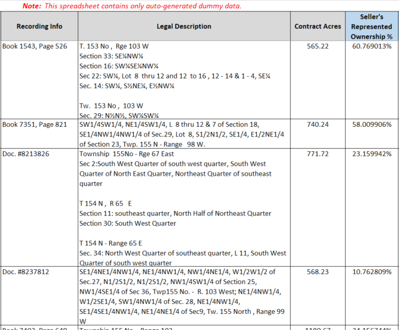
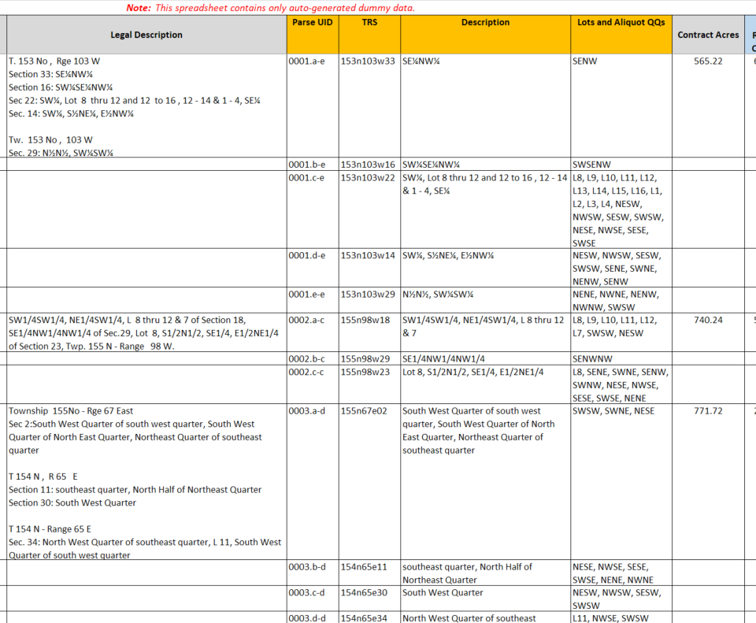
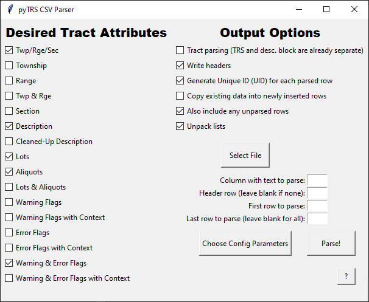

# Examples of pyTRS implementations


## Example Use #1 - Generating Plats:
As an example of how this library can be used, I built the [`pyTRSplat` module](https://github.com/JamesPImes/pyTRSplat) which uses on `pytrs` parsing to generate plats from raw text. For example, this text...

```
Township 154 North, Range 97 West
Section 1: Lots 1 - 3, S/2N/2
Section 5: Lot 4, The South Half of the Northwest Quarter, and The Southwest Quarter
Section 6: Lots 1 - 7, S/2NE/4, SE/4NW/4, E/2SW/4, SE/4
Section 13: That portion of the E/2 lying north of the river and west of the private road right-of-way as more particularly described in Book 1234 / Page 567, recorded on January 1, 1964 in the records of Example County, as amended in that Right-of-Way Amendment Agreement dated December 10, 1987, recorded on December 11, 1987 as Document No. 1987-1234567 of the records of Example County.
Section 14: NE/4
```
...results in this auto-generated plat (colors, size, etc. can be configured in the `pyTRSplat` module):


Use it as a module (imported as `pytrsplat`), or use [the GUI application](https://github.com/JamesPImes/pyTRSplat#included-gui-application):


Presumably, pyTRS could also be used with professional GIS software to generate more meaningful maps/insights.


## Example Use #2 - Breaking down large spreadsheets
As a very practical example, I created a Microsoft Excel macro that uses pyTRS to break down PLSS descriptions in a spreadsheet (which is exceedingly common in large land/energy acquisitions) into their component parts, inserting rows and columns as necessary, without breaking the Excel functions, tables, etc. *(I do consulting work in this field, so I don't make this macro publicly available on my GitHub, but [contact me](mailto:jamesimes@gmail.com) if you'd like to inquire about my consulting.)*

For example, these descriptions:



...get parsed into...




To give additional context to the above example: A utility company might purchase a large package of rights-of-way, or leases, or whatever -- spanning some tens of thousands of acres.  The seller might have acquired those assets over 40 years of business, and they might have been acquired or traded multiple times, and have gone through multiple rounds of data entry, system migrations, etc., so the data are all in varying layouts with different abbreviations, etc.

And because the seller is getting rid of the assets, they don't want to spend time and resources to clean up the data (especially as this might allow the buyer to find flaws more easily and negotiate down the purchase price before closing). Often, the seller will provide the buyer with a spreadsheet showing hundreds or thousands of documents, each covering a different chunk of land, but representing the entire description for that land in a single spreadsheet cell (without breaking it out by Twp/Rge/Section)--and with data that is full of typos and OCR artifacts.

The Excel macro uses pyTRS to take a crack at ironing all of that out, inserting the parsed data into new rows and columns.


## Example Use #3 - Breaking down .csv files

Included in the [`pyTRS/samples/` directory](https://github.com/JamesPImes/pyTRS/tree/master/samples/csv_parser) is an application with similar functionality to the Excel macro shown above, but which works only on .csv files.



*(Unlike the Excel macros, this application does not work on spreadsheets other than .csv format, so it cannot maintain formulas, tables, etc.)*


## Example Use #4 - inventorying files/reports

Included in the [`pyTRS/samples/` directory](https://github.com/JamesPImes/pyTRS/tree/master/samples/file_inventory) is a script I wrote to inventory title reports by Twp/Rge/Section based on their filenames.