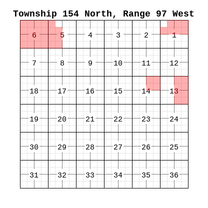
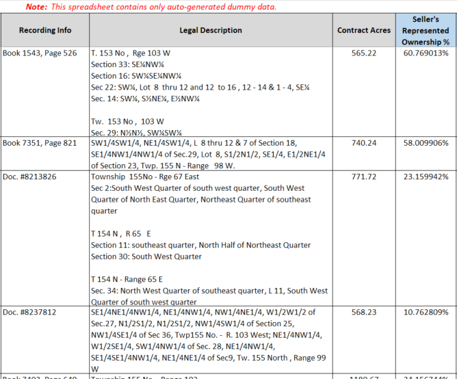
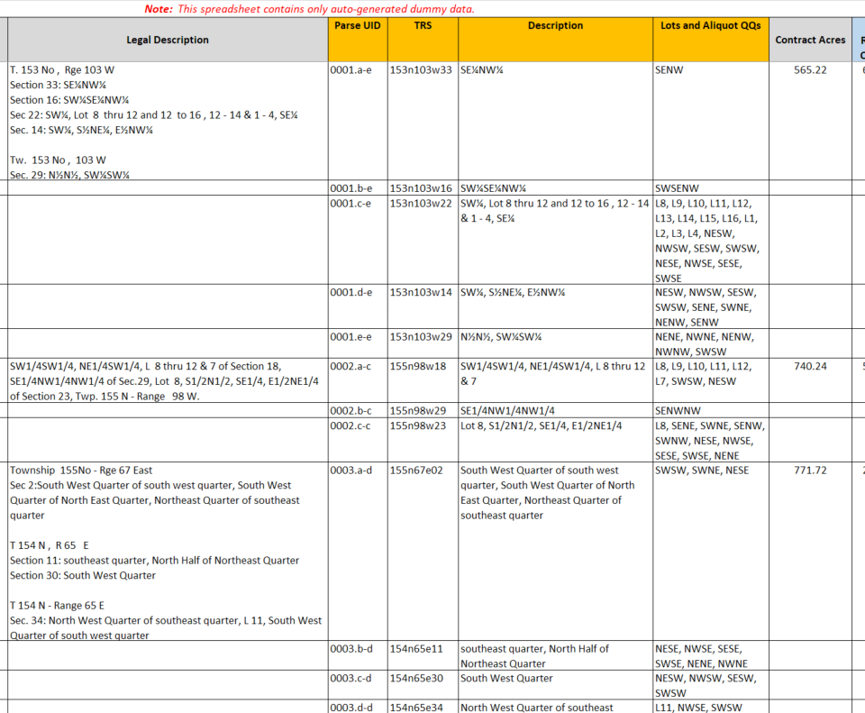

# pyTRS

pyTRS is a pure Python library for parsing Public Land Survey System (PLSS) land descriptions (or "legal descriptions") into their component parts, in a format that is more useful for data analysis, GIS mapping, spreadsheets, and databases generally. It accounts for common variations in layout, abbreviations, typos, etc. and can therefore process a range of real-world data.


## License
Copyright (c) 2020, James P. Imes, all rights reserved.

pyTRS, together with all accompanying programs and modules, is licensed under a 'Modified Academic Public License', modified from the OMNeT++ license, which was written by Andras Varga (license text is in public domain), as obtained at <https://omnetpp.org/intro/license>. __This modified license generally allows 'non-commercial' use and modification, but DISALLOWS ANY COMMERCIAL OR FOR-PROFIT USE, MODIFICATION, AND DISTRIBUTION.__  Read `LICENSE.txt` for the full terms and conditions. (Especially be aware that no results may be used in a legal document of any kind.)

Contact <jamesimes@gmail.com> with inquiries regarding commercial or for-profit use.


## To install

```
pip install git+https://github.com/JamesPImes/pyTRS@master
```


## Demonstration

A [more thorough quick start guide](https://github.com/JamesPImes/pyTRS/blob/master/documentation/quickstart.md) is provided elsewhere, but below is an example of parsing this simple PLSS land description:
```
Township 154 North, Range 97 West
Section 1: Lots 1 - 3 and the Southeast Quarter of the Northeast Quarter
Section 14: NE/4
Section 15: That portion of the W/2 lying south of the highway right-of-way
Township 155 North, Range 97 West
Section 22: ALL
```
Example parsing below. (`config='n,w,segment'` is optional here and doesn't cause any different results for this particular example. It's included only to show that `config` parameters can be used in that place.)

```
import pyTRS

txt = '''Township 154 North, Range 97 West
Section 1: Lots 1 - 3 and the Southeast Quarter of the Northeast Quarter
Section 14: NE/4
Section 15: That portion of the W/2 lying south of the highway right-of-way
Township 155 North, Range 97 West
Section 22: ALL'''

# create a `PLSSDesc` object with this text (`config=` is optional).
d_obj = pyTRS.PLSSDesc(txt, config='n,w,segment')

# Parse the description (`initParseQQ=True` causes any resulting tracts to be further parsed into lots/QQs)
d_obj.parse(initParseQQ=True)
```

The `pyTRS.PLSSDesc` object has now been parsed into `Tract` objects, which in turn have also been parsed into lots and QQs.

#### Access/compile the parsed data
The `Tract` objects resulting from the parsed `PLSSDesc` object are stored in a list in `d_obj.parsedTracts`.

Each `Tract` object has various instance attributes for the respective parsed data. They are spelled out in more detail in the documentation, but for these examples, we'll pull these attributes:

* `.trs` -- The Twp/Rge/Sec combo. Formatted such that Twp and Rge are 1 to 3 digits + direction, and section is 2 digits, and North/South and East/West are represented with the lowercase first letter. (ex: `Sec 1, T154N-R97W` -> `'154n97w01'`; or `Sec 14, T1S-R9E` -> `'1s9e14'`)

* `.twp` -- The Twp portion of .trs, a string (ex: `'154n'`)

* `.rge` -- The Rge portion of .trs, a string (ex: `'97w'`)

* `.sec` -- The Sec portion of .trs, a string (ex: `'01'`)

* `.desc` -- The description block within this TRS.

* `.QQList` -- A list of identified QQ's (or smaller)

* `.lotList` -- A list of identified lots.

In the following methods, specify which parsed data we want to extract from a parsed `Tract` by listing the attribute names (i.e. strings, without the leading period).


##### Print the parsed data to console
```
d_obj.print_data('twp', 'rge', 'sec', 'trs', 'desc', 'QQList', 'lotList')
```

... resulting in this printed to console:
```
Tract #1
twp     : 154n
rge     : 97w
sec     : 01
trs     : 154n97w01
desc    : Lots 1 - 3 and the Southeast Quarter of the Northeast Quarter
QQList  : SENE
lotList : L1, L2, L3

Tract #2
twp     : 154n
rge     : 97w
sec     : 14
trs     : 154n97w14
desc    : NE/4
QQList  : NENE, NWNE, SENE, SWNE
lotList : 

Tract #3
twp     : 154n
rge     : 97w
sec     : 15
trs     : 154n97w15
desc    : That portion of the W/2 lying south of the highway right-of-way
QQList  : NENW, NWNW, SENW, SWNW, NESW, NWSW, SESW, SWSW
lotList : 

Tract #4
twp     : 155n
rge     : 97w
sec     : 22
trs     : 155n97w22
desc    : ALL
QQList  : NENE, NWNE, SENE, SWNE, NENW, NWNW, SENW, SWNW, NESE, NWSE, SESE, SWSE, NESW, NWSW, SESW, SWSW
lotList : 
```


##### Compile the parsed data into dicts:

(i.e. a list of dicts, with one dict per parsed `Tract`)

```
stored_data = d_obj.tracts_to_dict('twp', 'rge', 'sec', 'trs', 'desc', 'QQList', 'lotList')
```

Which looks like this (formatted with linebreaks here, just for better visual representation):
```
[
{'twp': '154n',
'rge': '97w',
'sec': '01',
'trs': '154n97w01',
'desc': 'Lots 1 - 3 and the Southeast Quarter of the Northeast Quarter',
'QQList': ['SENE'],
'lotList': ['L1', 'L2', 'L3']},

{'twp': '154n',
'rge': '97w',
'sec': '14',
'trs': '154n97w14',
'desc': 'NE/4',
'QQList': ['NENE', 'NWNE', 'SENE', 'SWNE'],
'lotList': []},

{'twp': '154n',
'rge': '97w',
'sec': '15',
'trs': '154n97w15',
'desc': 'That portion of the W/2 lying south of the highway right-of-way',
'QQList': ['NENW', 'NWNW', 'SENW', 'SWNW', 'NESW', 'NWSW', 'SESW', 'SWSW'],
'lotList': []},

{'twp': '155n',
'rge': '97w',
'sec': '22',
'trs': '155n97w22',
'desc': 'ALL',
'QQList': ['NENE', 'NWNE', 'SENE', 'SWNE', 'NENW', 'NWNW', 'SENW', 'SWNW', 'NESE', 'NWSE', 'SESE', 'SWSE', 'NESW', 'NWSW', 'SESW', 'SWSW'],
'lotList': []}
]
```


##### Compile the parsed data into a nested list:

```
# as a nested list
stored_data =  d_obj.tracts_to_list('twp', 'rge', 'sec', 'trs', 'desc', 'QQList', 'lotList')
```
Which looks like this (again formatted with linebreaks for better visual representation):
```
[
['154n', '97w', '01', '154n97w01', 'Lots 1 - 3 and the Southeast Quarter of the Northeast Quarter', ['SENE'], ['L1', 'L2', 'L3']],

['154n', '97w', '14', '154n97w14', 'NE/4', ['NENE', 'NWNE', 'SENE', 'SWNE'], []],

['154n', '97w', '15', '154n97w15', 'That portion of the W/2 lying south of the highway right-of-way', ['NENW', 'NWNW', 'SENW', 'SWNW', 'NESW', 'NWSW', 'SESW', 'SWSW'], []],

['155n', '97w', '22', '155n97w22', 'ALL', ['NENE', 'NWNE', 'SENE', 'SWNE', 'NENW', 'NWNW', 'SENW', 'SWNW', 'NESE', 'NWSE', 'SESE', 'SWSE', 'NESW', 'NWSW', 'SESW', 'SWSW'], []
]
```


## Basic PLSS terminology

*__([Skip this section](https://github.com/JamesPImes/pyTRS#quick-start-guide-and-documentation) if you're already familiar with PLSS land descriptions generally, and the terms `township`, `range`, `section`, `aliquot quarter-quarter (QQ)`, and `lots`.)__*

Documentation for this module assumes some familiarity with the Public Land Survey System (PLSS), which (as is obvious from its name) is the system for how most of the continental United States was surveyed, and remains the primary  system for describing specific parcels of land (so long as they have not been platted into a subdivision or similar). If you are unfamiliar with the PLSS, [a brief primer is given here](https://github.com/JamesPImes/pyTRS/blob/master/documentation/plssPrimer.md).  Wikipedia also offers [a more in-depth summary](https://en.wikipedia.org/wiki/Public_Land_Survey_System).

Laypersons will probably intuitively understand the term 'land description' to mean some specific piece of land. However, land professionals often use the term 'legal description' (i.e. the *legally specific* description of a piece of land). For this program, the term 'PLSS description' is typically used, i.e. `PLSSDesc` objects. ('Legal description' is disfavored here, because not all legal descriptions fall under the PLSS -- e.g., subdivisions -- and cannot be parsed with this library.)

*__A full PLSS description consists of 4 components (which can vary in what order they appear in):__*

__[A] township__ -- designated by township number + North/South direction (i.e. `'154 North'`, or abbreviated `'154n'` in this module)

__[B] range__ -- designated by range number + East/West direction (i.e. `'97 West'`, or abbreviated `'97w'` in this module)

__[C] section number__ -- designated by a simple number, almost always between 1 and 36 (always formatted as two digits in this module, so: `'01'`)

__[D] description block__ (for lack of a better term) -- This is the text that clarifies what *portion* of the section is intended, and it must allow essentially any word, phrase, numbers, etc. as are necessary to describe real-world parcels, which are very often oddly-shaped and/or rely on natural or man-made landmarks.

*__Note:__ A single PLSS description might cover land across multiple sections and townships, especially when describing a large farm or ranch, state park, nature reserve, etc.*

(The name of this module is derived from [T]ownship, [R]ange, [S]ection -- i.e. the minimum required identifier for a unique section of land.)


*__When initially surveyed, a standard section of land was divided into 'aliquots' and/or 'lots' (although these need not appear in every PLSS description):__*

* `aliquot quarter-quarters` (usually called a `QQ` in this module), each of which is literally a square equal to 1/16th of a standard section (so 40 acres), arranged on a 4x4 grid.  `'the Southeast Quarter of the Northeast Quarter'` describes a QQ in the first example above, and gets abbreviated `'SENE'` in this module.

* `Lots`, which you can think of as ad-hoc QQ's. They were used when natural land features (bodies of water, mountains, etc.) -- or the curvature of the earth -- meant that a perfect grid of exactly 40-acre squares could not be maintained while still accurately depicting the surveyed land. To the extent possible, they still primarily exist in the 4x4 grid (taking the place of a QQ) but vary in size and shape as necessary. Lots are abbreviated `'L1'`, `'L2'`, etc. in this module.


## Quick Start Guide and Documentation
A quick start guide can be found [here](https://github.com/JamesPImes/pyTRS/blob/master/documentation/quickstart.md), which will point new users to the broad-strokes features.

For an implementation for parsing PLSS descriptions in .csv files, [look into the `pyTRS.csv_suite` package](https://github.com/JamesPImes/pyTRS/blob/master/documentation/csv_suite%20documentation/csv_readme.md), which also includes a GUI implementation (launch from console with `pyTRS.csv_suite.launch_gui()` or run `pyTRS\csv_suite\pyTRS_parse_csv_gui.pyw` directly).

The rest of the documentation is forthcoming. (It's one of few big tasks before a `v1.0.0` release of `pyTRS`). Nearly complete documentation can be found in docstrings, so Python's native `pydoc` module might be a decent option in the meantime.


## Who might use this library

pyTRS is intended for use by land professionals (right-of-way agents, petroleum land managers, GIS analysts, etc.), land records personnel, or researchers, who often work with large datasets of land descriptions that would be more usefully broken out into their component parts (township, range, section, and description), such as:
	`"Township 154 North, Range 97 West, 5th P.M., Section 14: Northeast Quarter and Lots 1 - 4"`

...into:
* **township:** `'154n'`
* **range:** `'97w'`
* **section:** `'14'`
* **TRS:** `'154n97w14'`
* **description:** `'Northeast Quarter and Lots 1 - 4'`
* **aliquot quarter-quarters (QQ's):** `['NENE', 'NWNE', 'SENE', 'SWNE']`
* **lots:** `['L1', 'L2', 'L3', 'L4']`

#### Example Use #1 - Generating Plats:
As an example of how this library can be used, the [`pyTRSplat` module](https://github.com/JamesPImes/pyTRSplat) builds on `pyTRS` parsing to generate plats. For example, parsing this text with `pyTRS` and platting it with `pyTRSplat`...

```
Township 154 North, Range 97 West
Section 1: Lots 1 - 3, S/2N/2
Section 5: Lot 4, The South Half of the Northwest Quarter, and The Southwest Quarter
Section 6: Lots 1 - 7, S/2NE/4, SE/4NW/4, E/2SW/4, SE/4
Section 13: That portion of the E/2 lying north of the river and west of the private road right-of-way as more particularly described in Book 1234 / Page 567, recorded on January 1, 1964 in the records of Example County, as amended in that Right-of-Way Amendment Agreement dated December 10, 1987, recorded on December 11, 1987 as Document No. 1987-1234567 of the records of Example County.
Section 14: NE/4
```
...results in this auto-generated plat (although colors, size, etc. can be configured in the [`pyTRSplat` module](https://github.com/JamesPImes/pyTRSplat)):



Presumably, pyTRS could also be used with professional GIS software to generate more meaningful maps/insights.


#### Example Use #2 - Breaking down large spreadsheets
As another practical example, an implementation of `pyTRS` in a Microsoft Excel macro breaks down PLSS descriptions in a spreadsheet (which is exceedingly common in large land/energy acquisitions) into their component parts, inserting rows and columns as necessary, without breaking the Excel functions, tables, etc. *(I do consulting work in this field, so I don't make this macro publicly available on my GitHub, but [contact me](mailto:jamesimes@gmail.com) if you'd like an educational license or to inquire about a commercial license.)*

For example, these descriptions:



...get parsed into...




To give additional context to the above example: A utility company might purchase a large package of right-of-way for powerlines (or whatever), spanning some tens of thousands of acres.  The seller might have acquired those assets over 40 years of business, and they might have been acquired or traded multiple times, and have gone through multiple rounds of data entry, system migrations, etc., so the data are all in varying layouts with different abbreviations, etc.  And because the seller is getting rid of the assets, they don't want to spend time and resources to clean up the data (especially as this might allow the buyer to find flaws more easily and negotiate down the purchase price before closing). Often, the seller will provide the buyer with a spreadsheet showing 1500 right-of-way documents, each covering a different tract (or multiple tracts) of land, with the lands covered by each of those right-of-way documents contained in a single spreadsheet cell--and with data that is full of typos and OCR artifacts.

Moreover, each spreadsheet row might cover lands in multiple sections, which makes sorting and filtering even harder. For example, if you're looking for only those documents relevant to Section 14 of Township 154 North, Range 97 West (i.e. '154n97w14'), your search results might be obfuscated by a document that covers lands in Section 14 of a different township (e.g., Sec 14 of T153N-R97W) and also a different section in your desired township (e.g., Sec 15 of T154N-R97W) -- i.e. 153n97w14 and 154n97w15, neither of which is what you're looking for, but some of whose components *appear* to match.

More challengingly, a PLSS description might read, "The N/2 of Sections 13 - 15, T154N-R97W" (meaning three tracts, being the N/2 of Section 13, the N/2 of Section 14, and the N/2 of Section 15 respectively, all in T154N-R97W) -- even though the phrase "Section 14" doesn't appear anywhere in that description.

pyTRS can be used to process such a spreadsheet and break down each land description into its component parts, such that each row contains a single section (denoted by TRS, or the combination of Township-Range-Section), and corresponding description.

At that point, it would be trivial to find whichever documents are relevant to Section 14 of Township 154 North - Range 97 West (i.e. '154n97w14'). The output would be plainly filterable / sortable spreadsheet.


## Functionality and Highlights


See [the documentation](https://github.com/JamesPImes/pyTRS/blob/master/documentation/documentation.md) for full functionality. However, below is a broad-strokes explanation of what pyTRS can do.


#### Handles Various Input Layouts

The components of a real-world PLSS description will often appear in varying order -- i.e. PLSS descriptions can have varying `'layout'`, as they are called in this module. pyTRS can account for these various layouts (all examples are describing the same land):

**-- Township - Range - Section - Description** (i.e. `'TRS_desc'`)  *__Note:__ This layout need not be on multiple lines, but it often is.*
```
T154N-R97W
Section 14: NE/4
```

**-- Description - Section - Township - Range** (i.e. `'desc_STR'`)
```
NE/4 of Section 14, T154N-R97W
```

**-- Section - Description - Township - Range** (i.e. `'S_desc_TR'`)
```
Section 14: NE/4, T154N-R97W
```
**-- Township - Range - Description - Section** (i.e. `'TR_desc_S'`)
```
T154N-R97W
NE/4 of Section 14
```

Moreover, `pyTRS` can automatically deduce the layout of the input. (This deduction can be overridden by the user, if needed.)

pyTRS also has a stopgap layout (`'copy_all'`) which can be used to ensure that the text is maintained in the event that the layout cannot be successfully deduced (perhaps due to an omission or unrecognizable misspelling of section, township, or range).


#### Misspellings and Abbreviations

pyTRS can also handle many misspellings and abbreviations of "Section", "Township", and "Range". However, avoiding false matches while maintaining robust functionality is a balance, which means that it is not possible to handle every typo and abbreviation. (For this reason and others, users should examine the results for fidelity.)


#### Default directions for Township/Range

Where North/South is not specified for Township, or East/West is not specified for Range, pyTRS can fill it in with user-specified defaults. So, for example, if the input data reads, "Township 154, Range 97, Section 14", the parsing algorithm can still interpret this as '154n97w14' (or '154s97e14', if that's how the defaults are set).

#### Aliquot ('QQ') and Lot Parsing
The description of a given `Tract` can be further parsed into smaller components: lots (e.g., "Lots 3 and 4") and aliquots (e.g., "the Northeast Quarter").

For example, pyTRS can parse this:
```
"Lots 3 - 5, and the Northeast Quarter of Section 14, and the W/2SW/4 of Section 15, T154N-R97W, and the SE/4SE/4 of Section 1, T155N-R97W"
```

...into this:
* `154n97w14` : `['L3', 'L4', 'L5', 'NENE', 'NWNE', 'SENE', 'SWNE']`
* `154n97w15` : `['NWSW', 'SWSW']`
* `155n97w01` : `['SESE']`

pyTRS is capable of recognizing all of the following as the 'Northeast Quarter', any of which may be enountered in the wild:
* NE/4
* NE4
* NE¼
* NE \*\*
* North East Quarter
* North East One Quarter
* Northeast One Quarter
* *[and other permutations]*

(Note: Neither lots nor aliquots are *required* for a valid land description, but they are the standard divisions of a section of land, and are therefore commonly encountered.)

\*\**NB: See [`cleanQQ`](https://github.com/JamesPImes/pyTRS/blob/master/documentation/documentation.md#using-the-cleanqq-config-setting-and-kwarg) regarding aliquot quarters and quarter-quarters that are abbreviated without a fraction symbol or '4' (e.g., 'NENE', 'NE', 'SW', 'NWSE', etc.).*

Similarly, pyTRS can robustly interpret halves. Each of these would be recognized as the 'East Half':
* E/2
* E2
* East Half
* East One Half
* East One-Half
* *[and other permutations]*


#### Parsing of more complicated descriptions (e.g., 'metes-and-bounds')

Examples so far have contained simple PLSS descriptions with clean aliquots and lots. However, pyTRS can also handle 'metes-and-bounds' and other more complicated descriptions. For example, this...
```
Township 154 North, Range 97 West
Section 14: Lot 4, and a portion of the NE/4 being more particularly described as follows:
	Beginning at the Northeast corner of the NE/4, being the point of beginning;
	Thence running south along the east line of said Section 14 for 200 feet;
	Thence due west 100 feet;
	Thence due north, parallel with the east line of said Section 14 for 200ft, to the north line of the NE/4 of said Section 14;
	Thence due east 100ft to the point of beginning;
	Said tract containing 0.459137 acres, more or less
Section 15: A portion of the W/2, originally conveyed to John Smith in Deed dated May 1, 1974
```

... can be parsed into this:
* **first Tract:**
	* `twp`  :  `'154n'`
	* `rge`  :  `'97w'`
	* `sec`  :  `'14'`
	* `trs`  :  `'154n97w14'`
	* `desc`  :  `'Lot 4, and a portion of the NE/4 being more particularly described as follows:
			Beginning at the Northeast corner of the NE/4, being the point of beginning;
			Thence running south along the east line of said Section 14 for 200 feet;
			Thence due west 100 feet;
			Thence due north, parallel with the east line of said Section 14 for 200ft, to the north line of the NE/4 of said Section 14;
			Thence due east 100ft to the point of beginning;
			Said tract containing 0.459137 acres, more or less'`
 
* **second Tract:**
    * `twp`  :  `'154n'`
	* `rge`  :  `'97w'`
	* `sec`  :  `'15'`
	* `trs`  :  `'154n97w15'`
	* `desc`  :  `'A portion of the W/2, originally conveyed to John Smith in Deed dated May 1, 1974'`

*(Note, however, that aliquot and lot parsing will likely be less accurate for such descriptions.)*


## Disclaimer and Limitations
Be sure to read the full disclaimer in `LICENSE.txt`. However, some non-obvious limitations should be pointed out specifically:
* __MOST IMPORTANTLY:__ This library is not to be used for creating or modifying legal descriptions that will be used in any legal document. It is intended for data-analysis purposes only.

* This library is not licensed for any commercial or for-profit use. Contact <jamesimes@gmail.com> for commercial or for-profit licensing inquiries.

* All results should be proofread by the user to ensure fidelity, due to flaws, typos, and non-standardized abbreviations and formatting in the input data, and possible bugs or limitations in the Software itself.

* pyTRS can account for many typos/abbreviations and formatting differences. However, even if the input data is 'correctly' formatted (i.e. accurately describes the correct lands), it may NOT capture every edge case. pyTRS can generate warning flags and error flags for the user's review (but depending on the implementation, those flags may not be accessible by the end user). However, the absence of such a flag is not conclusive proof that the output is correct. Generally speaking, the cleaner and more standard the input data, the better the output data.

* Finally, note that all of the example PLSS descriptions used in the comments in the code and documentation are dummy data and were invented or arbitrarily chosen. (Some are even nonsense.)

*(This list should not be construed as limiting the full warranty, available in `LICENSE.txt`.)*


## Upcoming / TODO
`pyTRS` is nearly ready for a `v1.0.0 ` release. I'm hoping to have one out before the end of 2020. At this point, I'm mostly cleaning up a few comments and working on a clean output of the documentation (although docstrings currently contain nearly complete documentation on their own -- so you can access all of it with Python's `pydoc` module).


## Requirements
The pyTRS library itself is pure Python:

* Python 3.6+

*(NOTE: `pyTRS` was written and tested in Python version 3.8.2, but is expected to work with all versions of Python more recent than 3.6. It's been tested in a Windows 10 environment; and has not been tested on macOS or Linux. I doubt any of the primary parsing functionality will struggle with other operating systems, but possibly some of the saving/loading/csv functionality might require some tweaking. I'd be interested in hearing any issues you run into.)*