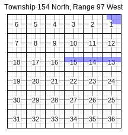

# pyTRS

pyTRS (imported as `pytrs`) is a Python library for parsing [Public Land Survey System (PLSS)](https://en.wikipedia.org/wiki/Public_Land_Survey_System) land descriptions (or "legal descriptions") for use in data analysis, GIS mapping, spreadsheets, etc. It accounts for common variations in layout, abbreviations, typos, etc. and can therefore process a range of real-world data.

## Quick example

We have this land description and want to break it into tabular data: `'T154N-R97W Sec 1: Lots 1 - 3, S/2NE/4, Sec 13 - 15: S/2N/2'`
```
import pytrs

text_to_parse = 'T154N-R97W Sec 1: Lots 1 - 3, S/2NE/4, Sec 13 - 15: S/2N/2'

parsed = pytrs.PLSSDesc(text_to_parse, parse_qq=True)
parsed.tracts_to_csv(
    attributes=['twp', 'rge', 'sec', 'desc', 'lots', 'qqs'],
    fp=<some filepath>, mode='w')
```
This example writes a .csv file that looks like this (with `'Sec 13 - 15: S/2N/2'` broken out as the S½N½ of each Section 13, 14, and 15):

| twp | rge | sec | desc          | lots |   qqs |
|------|-----|-----|---------------|------|--------|
| 154n | 97w | 01  | Lots 1 - 3, NE/4 | L1, L2, L3 | SENE, SWNE |
| 154n | 97w | 13  | S/2N/2 | | SENE, SWNE, SENW, SWNW |
| 154n | 97w | 14  | S/2N/2 | | SENE, SWNE, SENW, SWNW |
| 154n | 97w | 15  | S/2N/2 | | SENE, SWNE, SENW, SWNW |

We can alternatively compile these data fields (and [others](guides/guides/tract_attributes.md#tract-attributes)) into a list of dicts, nested list of lists, and other [options](guides/guides/extracting_data.md#extracting-bulk) -- or just accessed individually as `Tract` object attributes.

The above parsed data were used to generate the following plat with the [pyTRSplat](https://GitHub.com/JamesPImes/pyTRSplat) extension:




## Who might use this library?

Anybody who works with land records or land use (right-of-way agents; land managers in oil and gas, wind, or solar; GIS analysts; environmental researchers; etc.).  If you've ever had a database or spreadsheet with land descriptions in it, you might have a use for pyTRS.

A few uses and examples [are showcased here](guides/guides/examples.md).


## License
Copyright © 2020-2022, James P. Imes, all rights reserved.

#### *__pyTRS is NOT licensed for ANY commercial or for-profit use. [Contact me at <jamesimes@gmail.com>](mailto:jamesimes@gmail.com) for licensing inquiries, or to inquire about my consulting, or just to say hello / offer feedback.__*

pyTRS, together with all accompanying programs and modules, is licensed under a 'Modified Academic Public License', modified from the OMNeT++ license, which was written by Andras Varga (license text is in public domain), as obtained at <https://omnetpp.org/intro/license>. __This modified license generally allows 'non-commercial' use and modification, but DISALLOWS ANY COMMERCIAL OR FOR-PROFIT USE, MODIFICATION, AND DISTRIBUTION.__  Read `LICENSE.txt` for the full terms and conditions. (Especially be aware that no results may be used in a legal document of any kind.)


## To install

```
pip install git+https://github.com/JamesPImes/pyTRS.git@master
```

(To install a specific release, use `...pyTRS.git@<version>`, i.e. `...JamesPImes/pyTRS.git@v2.1.0`.)


## Quickstart Guide
A series of guides can be found [here](guides/readme.md), which will point new users to the broad-strokes features. The [quickstart guide](guides/guides/quickstart.md) is probably a good place to get your bearings.

## Documentation

Full documentation is available on [ReadTheDocs](https://pytrs.readthedocs.io/en/latest/index.html).

## Disclaimer and Limitations
Be sure to read the full disclaimer in [`LICENSE.txt`](LICENSE.txt). However, some non-obvious limitations should be pointed out specifically:
* __MOST IMPORTANTLY:__ This library is not to be used for creating or modifying legal descriptions that will be used in any legal document. It is intended for data-analysis purposes only.

* This library is not licensed for any commercial or for-profit use. [Contact <jamesimes@gmail.com>](mailto:jamesimes@gmail.com) for commercial or for-profit licensing inquiries, or to inquire about consulting.

* All results should be proofread by the user to ensure fidelity, due to flaws, typos, and non-standardized abbreviations and formatting in the input data, and possible bugs or limitations in the Software itself.

* pyTRS can account for many typos/abbreviations and formatting differences. However, even if the input data is 'correctly' formatted (i.e. accurately describes the correct lands), it may NOT capture every edge case. pyTRS can generate warning flags and error flags for the user's review (but depending on the implementation, those flags may not be accessible by the end user). However, the absence of such a flag is not conclusive proof that the output is correct. Generally speaking, the cleaner and more standard the input data, the better the output data.

* Finally, note that all example PLSS descriptions used in the comments in the code and documentation are dummy data and were invented or arbitrarily chosen. (Some are even nonsense.)

*(This list should not be construed as limiting the full disclaimer, available in `LICENSE.txt`.)*


## Requirements
The pyTRS library is pure Python and should work with Python 3.6+.

(Explicitly tested in Python 3.10.6 and Python 3.6.8.)

The functions and classes in ``pytrs.interface_tools`` use ``tkinter``, so Linux users will presumably need to explicitly install that, but only if the ``iterface_tools`` module is needed.
